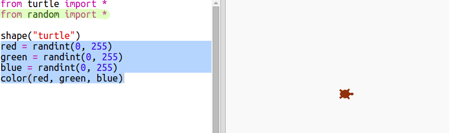

## ألوان عشوائية

+ افتح هذا المشروع trinket: <a href="https://trinket.io/python/3e3ffa9d6f" target="_blank">trinket.io/python/3e3ffa9d6f</a>.

+ يمكنك ضبط لون السلحفاة من خلال تحديد مقدار اللون الأحمر والأخضر والأزرق الذي تريده من 0 إلى 255.
    
    أضف الرمز التالي للحصول على سلحفاة أرجوانية:
    
    
    
    يتكون اللون الأرجواني عن طريق خلط اللونين الأحمر والأزرق معا.

--- collapse ---
---
title: "Error - bad color sequence: (150, 0, 150)"
---

هل حصلت على الخطأ `Error - bad color sequence: (150, 0, 150)` عند تشغيل الكود.

وذلك لأن trinket يستخدم وضع لون مختلف لمحرري python الآخرين. ويمكن أن تكون ثابتة عن طريق تغيير `colormode` إلى `255`.

```python
from turtle import *

colormode(255)

shape("turtle")
color(150,0,150)
```

--- /collapse ---

+ جرب بعض الأرقام المختلفة للحصول على ألوان مختلفة.
    
    تذكر أن كل رقم يمكن أن يكون من 0 إلى 255.

+ ماذا عن اختيار لون عشوائي؟
    
    قم بتحديث الرمز الخاص بك لاختيار رقم عشوائي بين 0 و 255 للقيم الحمراء والخضراء والزرقاء:
    
    

+ انقر فوق "تشغيل" عدة مرات للحصول على السلاحف الملونة المختلفة.

+ إنه أمر ممتع، لكن يجب تذكره وكتابته في كل مرة تريد فيها تعيين سلحفاة بلون عشوائي وليس من السهل قراءتها.
    
    في اللغة البرمجية Python، يمكننا كتابة `def` لتحديد وظيفة يمكننا استدعائها كلما احتجنا إلى تعيين السلحفاة على لون عشوائي.
    
    لقد قمت باستدعاء وظائف بالفعل، `color()` و `randint ()` هي وظائف تم تحديدها لك.
    
    دعونا نضع رمز اللون العشوائي في وظيفة باستخدام def:
    
    
    
    تأكد من المسافة البادئة للرمز داخل الوظيفة. توضع الوظائف عادةً في الجزء العلوي من البرنامج النصي بعد الاستيراد.

+ إذا قمت "بتشغيل" الرمز الآن، فلن تحصل على سلحفاة ملونة عشوائية. لأنك حددت وظيفتك، لكنك لم تقم بأستدعائها بعد.

+ أضف سطرا لأستدعاء وظيفتك الجديدة:
    
    
    
    لاحظ أن الشفرة الجديدة أسهل بكثير في فهمها، لأن الجزء المعقد - في الوظيفة. من السهل معرفة ما يفعله `randomcolour ()`.