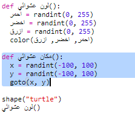
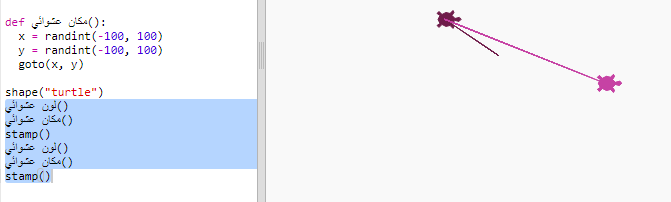
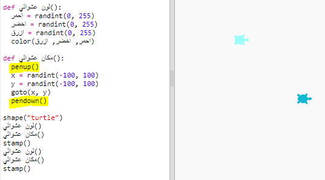

## مكان عشوائي

لنقم بإنشاء وظيفة أخرى لنقل السلاحف إلى مكان عشوائي على الشاشة. مركز الشاشة هو (0،0) لذلك سنضع السلاحف في منطقة مربعة حول المركز.

+ إضافة وظيفة `randomplace()`:
    
    

+ جرب وظيفتك الجديدة عن طريق الاستدعاء، ثم استدعاء `stamp ()`، يمكنك استدعائها أكثر من مرة:
    
    

+ عفوًا، ترسم السلاحف عندما تتحرك. دعنا نضع القلم للأعلى في البداية وإلى الأسفل في النهاية حتى لا ترسم السلاحف أثناء تحركها:
    
    
    
    هل لاحظت أنه كان عليك فقط "إصلاح" الكود في مكان واحد؟ هذا شيء جيد آخر عن الوظائف.

+ الآن اختبر التعليمات البرمجية الخاصة بك عدة مرات.