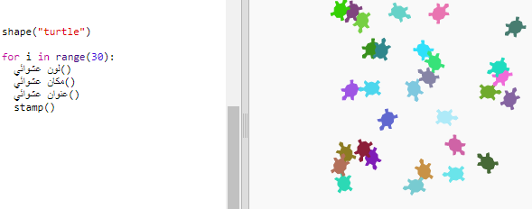

\--- challenge \---

## التحدي: رسومات السلحفاة

هل يمكنك تحديد دالة `randomheading ()` التي تجعل نقطة السلحفاة في اتجاه عشوائي وتجعل الكود التالي يعمل؟

تلميح:

- `setheading (<number>)` سيغير الاتجاه الذي تواجهه السلحفاة.

- يجب أن تكون `<number>` بين 1 و 360 (عدد الدرجات في دائرة)

- يمكنك استخدام `randint (1، 360)` لاختيار رقم يتراوح بين 1 و 360.

\--- challenge/ \---