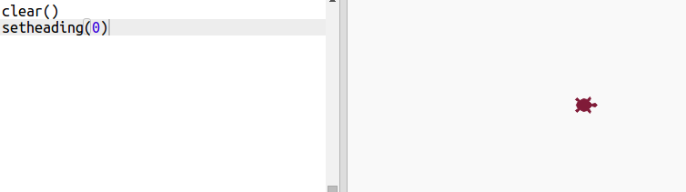
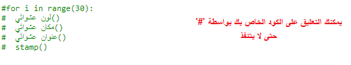
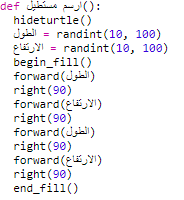
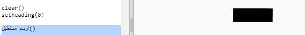
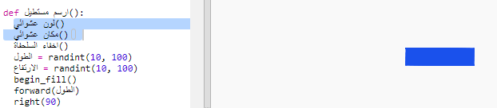
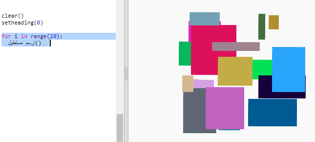

## إنشاء فن حديث باستخدام أشكال مستطيلة

لننشئ فنًا حديثًا برسم مستطيلات كثيرة ذات أحجام وألوان مختلفة. 

+ أولًا، أضف التعليمة البرمجية التالية أسفل المقطع البرمجي، بعد التعليمات البرمجية التي كتبتها في جزء التحدي، لمسح الشاشة بعد انتهاء رسومات السلحفاة وتوجيه السلحفاة في اتجاهها العادي:

    

+ يمكنك تعليق التعليمات البرمجية لرسومات السلحفاة بوضع الرمز `#` في بداية كل سطر بحيث لا تعمل هذه التعليمات البرمجية أثناء تشغيل رسومات المستطيلات. (ثم يمكنك إلغاء تعليقها بعد ذلك لعرض عملك كاملًا).

    
 
+ لنضف الآن دالة لرسم مستطيل يظهر في أماكن عشوائية بأحجام وألوان عشوائية! 
    
    أضف دالة `()drawrectangle` بعد الدوال الأخرى:

    
    
    راجع الملف `snippets.py` للاطلاع على بعض التعليمات البرمجية المساعدة إذا كنت تريد توفير بعض الوقت في الكتابة. 
    
+ أضف التعليمة البرمجية التالية أسفل الملف `main.py` لاستدعاء الدالة الجديدة:

    
    
    شغِّل المقطع البرمجي عدة مرات لترى تغييرات الارتفاع والعرض للمستطيل. 
   
+ يكون المستطيل باللون نفسه ويبدأ في المكان نفسه دائمًا. 

    ستحتاج الآن إلى تعيين السلحفاة إلى لون عشوائي ثم تحريكها إلى مكان عشوائي. ألم تُنشئ دالَّتَين تفعلان ذلك بالفعل؟ رائع. كل ما عليك هو استدعاء هاتين الدالتين في بداية الدالة `()drawrectangle`: 
    
    
    
    رائع، استخدمنا تعليمات برمجية كثيرة بإدخال بسيط تسهُل قراءته. 

    
+ لنستدعِ الآن الدالة '`()drawrectangle` في حلقة تكرار لإنشاء فن حديث رائع:

    

+ تبدو الرسومات بطيئة نوعًا ما! لكن يمكننا زيادة سرعة السلحفاة. 

    ابحث عن السطر الذي عيَّنتَ فيه الشكل إلى 'turtle' وأضف التعليمة البرمجية المظللة:
    
    
    
    قيمة `(‏0)speed` هي أقصى سرعة للسلحفاة، لكن يمكنك استخدام أرقام من 1 (بطيء) إلى 10 (سريع). جرِّب أرقامًا مختلفة إلى أن تحصل على السرعة التي تريدها. 

