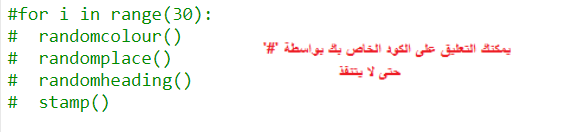
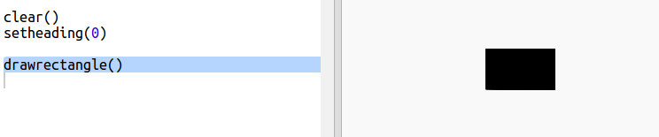

## إنشاء فن حديث باستخدام أشكال مستطيلة

الآن لنقم بإنشاء بعض الأعمال الفنية الحديثة من خلال رسم الكثير من المستطيلات ذات الأحجام والألوان المختلفة.

+ أولاً قم بإضافة الكود التالي إلى أسفل البرنامج النصي، بعد رمز التحدي الخاص بك، لمسح الشاشة بعد فن السلاحف الخاص بك وتوجيه السلاحف في اتجاهها المعتاد:
    
    

+ يمكنك التعليق على شفرة فنون السلاحف الخاصة بك عن طريق وضع `#` في بداية كل سطر بحيث لا يعمل أثناء عملك على فن المستطيلات. (بعد ذلك يمكنك إلغاء الضغط عليه لاحقًا لعرض جميع أعمالك.)
    
    

+ الآن، دعونا نضيف وظيفة لرسم مستطيل عشوائي الحجم بلون عشوائي في مكان عشوائي!
    
    أضف `drawrectangle()` بعد وظائفك الأخرى:
    
    
    
    ابحث في `snippets.py` عن بعض التعليمات البرمجية لمساعدتك إذا كنت تريد توفير بعض الوقت في الكتابة.

+ أضف الكود التالي في أسفل `main.py` لاستدعاء وظيفتك الجديدة:
    
    
    
    قم بتشغيل البرنامج النصي عدة مرات لرؤية تغيير الطول والعرض.

+ المستطيل هو دائما نفس اللون ويبدأ في نفس الموقع.
    
    ستحتاج الآن إلى تعيين السلحفاة على لون عشوائي ثم نقله إلى مكان عشوائي. مهلا، ألم تقم بالفعل بإنشاء وظائف للقيام بذلك؟ مدهش. يمكنك استدعائهم من بداية وظيفة drawrectangle:
    
    
    
    نجاح باهر، كان أقل بكثير من العمل، ومن الأسهل قرأته الان.

+ الآن دعنا ندعو `drawrectangle ()` في loop لإنشاء بعض الفن الحديث الرائع:
    
    

+ يا إلهي كان بطيئا بعض الشيء، أليس كذلك! لحسن الحظ يمكنك تسريع السلحفاة.
    
    ابحث عن السطر الذي قمت بتعيين الشكل فيه على "turtle" وأضف الرمز المميز:
    
    
    
    `speed(0)` هي الأسرع أو يمكنك استخدام الأرقام من 1 (بطيء) إلى 10 (سريع.) قم بالتجربة حتى تجد السرعة التي تريدها.