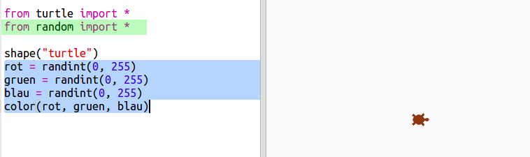
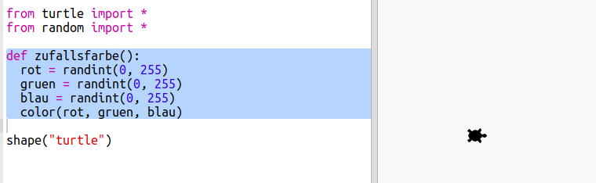
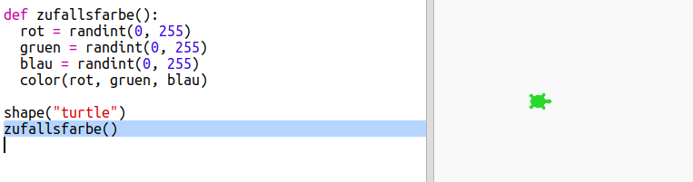

## Zufällig ausgesuchte Farben

+ Dieses Trinket öffnen: <a href="http://jumpto.cc/modern-go" target="_blank">jumpto.cc/modern-go</a>. 

+ Du kannst die Farbe einer Schildkröte bestimmen, indem du festlegst, wie viel rot, grün und blau du von 0 bis 255 auswählst. 

    Füge den folgenden Code hinzu, um eine lila Schildkröte zu erhalten:

    
   
    Lila wird aus der Mischung von zwei Farben, nämlich rot und blau, hergestellt.

+ Probiere mal ein paar verschiedene Ziffern aus, um unterschiedliche Farben zu erhalten. 

    Bitte denk daran, jede Ziffer kann von 0 bis 255 gehen. 

+ Wie wäre es, wenn du eine Farbe einfach zufällig aussuchst?

    Aktualisiere deinen Code und wähle eine zufällig ausgesuchte Ziffer zwischen 0 und 255 für die Werte von rot, grün und blau:
    
    

+ Klicke ein paar Mal auf ‘Run’ (laufen lassen), um unterschiedlich gefärbte Schildkröten zu erhalten.

+ Das ist zwar toll, aber man muss sich hierbei jedoch unheimlich viel merken und dies jedes Mal neu eintippen, wenn man die Schildkröte zu einer zufällig ausgesuchten Farbe einstellen will. Außerdem ist es schwer zu lesen. 

    In Python können wir `def` (definieren) schreiben, um eine Funktion zu  definieren, die wir aufrufen können, wannimmer wir die Schildkröte zu einer zufällig ausgesuchten Farbe einstellen wollen. 

    Du hast bereits schon Funktionen aufgerufen: `color()` (Farbe) und `randint()` sind Funktionen, die für dich definiert worden sind. 

    Lass uns den zufällig ausgesuchten Farbcode in eine Funktion eingeben mit Hilfe von def (definieren):
  
    
    
  Achte darauf, dass du den Code innerhalb der Funktion einrückst. Funktionen werden normalerweise über dem Script nach den Importen platziert. 
  
+ Wenn du jetzt auf deinen Code ‘Run’ (laufen lassen) klickst, wirst du nun keine zufällig ausgesuchte Farbe für deine Schildkröte erhalten. Das liegt daran, dass due deine Funktion zwar definiert hast, du hast sie aber noch nicht aufgerufen. 
  
+ Füge eine neue Zeile hinzu, um deine Funktion aufzurufen:
  
    

    Siehst du jetzt, dass der neue Code viel leichter zu verstehen ist, weil der komplexe Teil die Funktionen sind? Es ist einfach herauszufinden, was `randomcolour()` (zufällig ausgesuchte Farbe) macht.
