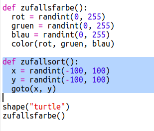

## Zufällig ausgesuchter Ort

Lass uns eine weitere Funktion herstellen, um die Schildkröte zu einem beliebigen Platz auf dem Bildschirm zu bewegen. Die Mitte des Bildschirms ist (0,0), wir müssen die Schildkröte daher in einen quadratischen Bereich rund um die Mitte setzen. 

+ Füge eine `randomplace()` (zufällig ausgesuchter Ort) Funktion hinzu:

    
    
+ Probiere deine neue Funktion aus, indem du sie aufrufst und rufe dann `stamp()` (stempeln) auf, du kannst es mehr als einmal aufrufen:

    

+ Ach herrje! Die Schildkröte zieht, wenn sie sich bewegt. Lass uns den Stift am Anfang hoch- und am Ende runternehmen, damit die Schildkröte nicht zieht während sie sich bewegt:

    
    
    Hast du gemerkt, dass du den Code nur an einem Platz 'fix' (beheben) musstest? Das ist der Vorteil an den Funktionen. 

+ Teste jetzt deinen Code ein paar Mal.
