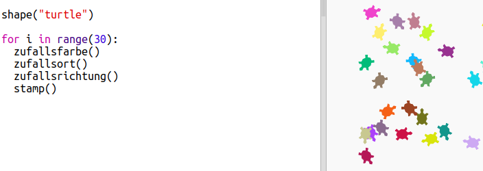

--- challenge ---

## Aufgabe: Schildkröten-Kunst

Kannst du eine Funktion `zufallsrichtung()` definieren, die die Schildkröte in eine zufällige Richtung zeigen läßt und den folgenden Code zum Laufen bringt?

Hinweise:

- `setheading(&lt;number&gt;)` ändert die Richtung, in die die Schildkröte zeigt.

- `&lt;number&gt;` sollte zwischen 1 und 360 liegen (die Anzahl der Grade in einem Kreis)

- Du kannst `randint(1, 360)` verwenden, um eine Zahl zwischen 0 und 360 zu wählen.

--- /challenge ---