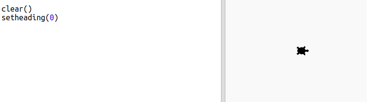
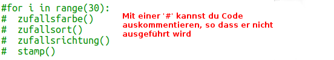
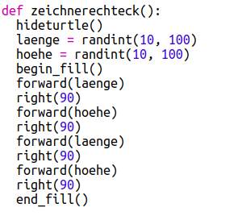
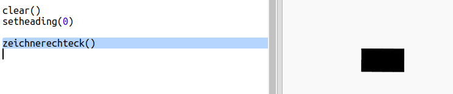
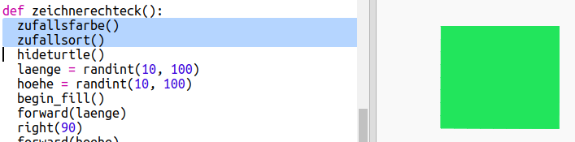
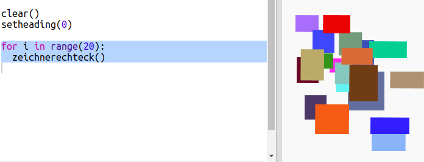

## Moderne Kunst aus Rechtecken erstellen

Lass uns nun einige moderne Kunstwerke erstellen, indem du viele Rechtecke in verschiedenen Größen und Farben zeichnest.

+ Zuerst fügst du den folgenden Code nach dem Challenge-Code am Ende deines Skripts ein, um den Bildschirm nach deiner Schildkröten-Kunst zu löschen und die Schildkröte in ihre normale Richtung zu weisen:
    
    

+ Du kannst deinen Schildkröten-Kunst Code auskommentieren, indem du ein `#` an den Beginn jeder Zeile setzt, die beim Programmlauf übersprungen werden soll. (Dann kannst du ihn später wieder aktivieren, um deine gesamte Arbeit zu zeigen.)
    
    

+ Fügen wir nun eine Funktion hinzu, um ein Rechteck mit zufälliger Größe und zufälliger Farbe an einer zufälligen Stelle zu zeichnen!
    
    Füge eine `zeichnerechteck()` Funktion nach deinen anderen Funktionen hinzu:
    
    
    
    Schaue in `snippets.py` nach etwas Hilfscode, wenn du etwas Zeit sparen möchtest.

+ Füge den folgenden Code am Ende von `main.py` hinzu, um deine neue Funktion aufzurufen:
    
    
    
    Run your script a few times to see the height and width change.

+ The rectangle is always the same colour and starts at the same location.
    
    Now you’ll need to set the turtle to a random colour and then move it to a random place. Hey, didn’t you already create functions to do that? Awesome. You can just call them from the beginning of the drawrectangle function:
    
    
    
    Wow that was a lot less work, and it’s much easier to read.

+ Now let's call `drawrectangle()` in a loop to create some cool modern art:
    
    

+ Gosh that was a bit slow wasn’t it! Luckily you can speed the turtle up.
    
    Find the line where you set the shape to 'turtle' and add the highlighted code:
    
    
    
    `speed(0)` is the fastest or you can use numbers from 1 (slow) to 10 (fast.) Experiment until you find a speed you like.