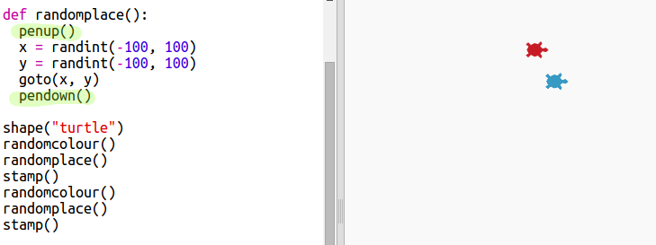

## Τυχαία θέση

Ας δημιουργήσουμε άλλη μια άλλη συνάρτηση για να μετακινήσουμε τη χελώνα σε μία τυχαία θέση στην οθόνη. Το κέντρο της οθόνης είναι το (0,0) οπότε θα τοποθετήσουμε χελώνες σε μια τετράγωνη περιοχή γύρω από το κέντρο.

+ Πρόσθεσε μια συνάρτηση `randomplace()`:
    
    

+ Δοκίμασε τη νέα σου συνάρτηση καλώντας την και στη συνέχεια με τη βοήθεια της `stamp()`, μπορείς να την καλέσεις περισσότερες από μία φορές:
    
    

+ Ουπς, όταν μετακινείται η χελώνα, συνεχίζει να ζωγραφίζει. Σηκώνουμε το στυλό στην αρχή και το κατεβάζουμε στο τέλος, έτσι ώστε να μην ζωγραφίζει ενώ κινείται:
    
    
    
    Παρατήρησες ότι έπρεπε να «διορθώσεις» τον κώδικα σε ένα μόνο μέρος; Να ένα ακόμη πλεονέκτημα των συναρτήσεων.

+ Τώρα δοκίμασε τον κώδικά σου μερικές φορές.