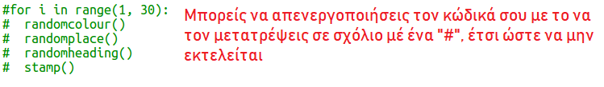

## Δημιούργησε σύγχρονη τέχνη με ορθογώνια

Τώρα ας δημιουργήσουμε σύγχρονη τέχνη, ζωγραφίζοντας πολλά ορθογώνια διαφόρων μεγεθών και χρωμάτων.

+ Πρώτα πρόσθεσε τον παρακάτω κώδικα στο κάτω μέρος του προγράμματός σου, μετά τον κώδικα της πρόκλησης, για να καθαρίσεις την οθόνη μετά την προηγούμενη πρόκληση και να στρέψεις τη χελώνα προς την κανονική της κατεύθυνση:
    
    

+ Μπορείς να απενεργοποιήσεις τη χελώνα μετατρέποντας σε σχόλιο τον προηγούμενο κώδικα τοποθετώντας ένα `#` στην αρχή κάθε γραμμής έτσι ώστε να μην τρέχει ενώ εργάζεσαι σε αυτή την πρόκληση. (Αργότερα μπορείς να την ενεργοποιήσεις πάλι για να αναδείξεις όλη την εργασία σου.)
    
    

+ Τώρα ας προσθέσουμε μια συνάρτηση για να σχεδιάσουμε ένα ορθογώνιο τυχαίου μεγέθους, τυχαίου χρώματος σε τυχαία θέση!
    
    Πρόσθεσε μια συνάρτηση `drawrectangle()` μετά τις άλλες συναρτήσεις:
    
    
    
    Μπορείς να βρεις στο `snippets.py` βοηθητικό κώδικα, εάν θέλεις να εξοικονομήσεις λίγο χρόνο πληκτρολόγησης.

+ Πρόσθεσε τον παρακάτω κώδικα στο κάτω μέρος του `main.py` για να καλέσεις τη νέα σου συνάρτηση:
    
    
    
    Τρέξε το πρόγραμμά σου μερικές φορές για να δεις την αλλαγή στο ύψος και στο πλάτος.

+ Το ορθογώνιο είναι πάντα το ίδιο χρώμα και ξεκινά από την ίδια θέση.
    
    Τώρα θα χρειαστεί να αλλάξεις το χρώμα της χελώνας σε κάποιο τυχαίο και στη συνέχεια να την μετακινήσεις σε τυχαία θέση. Μια στιγμή, δεν δημιούργησες ήδη συναρτήσεις για να το κάνεις αυτό; Τέλεια. Μπορείς απλά να τις καλέσεις στην αρχή της συνάρτησης drawrectangle:
    
    
    
    Τελικά έγινε πολύ πιο γρήγορα και πλέον είναι και ευκολότερο να το διαβάσεις.

+ Τώρα ας καλέσουμε την `drawrectangle()` σε ένα βρόχο για να δημιουργήσουμε υπέροχη μοντέρνα τέχνη:
    
    

+ Είναι όμως λίγο αργό! Ευτυχώς μπορείς να το επιταχύνεις.
    
    Βρες τη γραμμή στην οποία καθορίζεις το σχήμα να είναι χελώνα και πρόσθεσε τον τονισμένο κώδικα:
    
    
    
    Η εντολή `speed(0)` είναι η πιο γρήγορη αλλά μπορείς να χρησιμοποιήσεις τους αριθμούς από 1 (για αργά) έως 10 (για γρήγορα). Πειραματίσου μέχρι να βρεις την ταχύτητα που σου αρέσει.