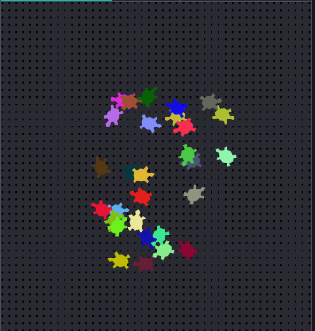

--- challenge ---

## Challenge: Turtle art

Can you define a `randomheading()` function that will make the turtle point in a random direction and make the following code work?

--- code ---
---
language: python
filename: main.py
line_numbers: true
line_number_start: 29
line_highlights: 
---
for i in range(1, 30):
    randomcolour()
    randomplace()
    randomheading()
    stamp()
--- /code ---

Hints:

- `setheading(<number>)` will change the direction the turtle is facing in.

- `<number>` should be between 1 and 360 (the number of degrees in a circle)

- You can use `randint(1, 360)` to choose a number between 1 and 360.

--- /challenge ---