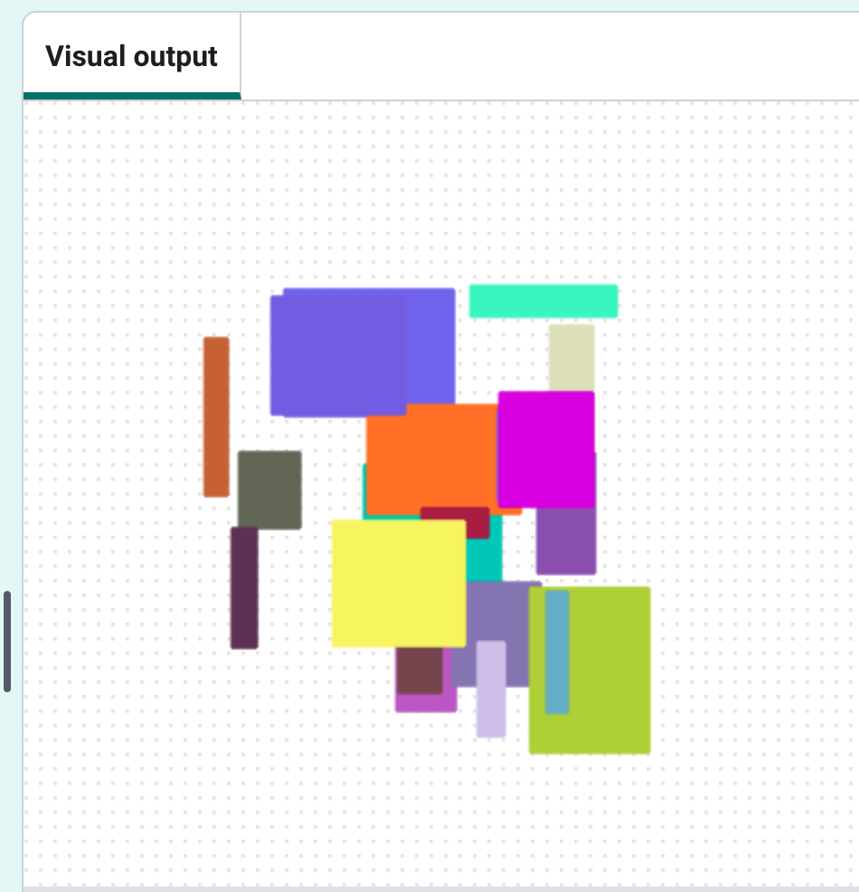

## Modern art

Create some modern art by drawing lots of rectangles of different sizes and colours. 

--- task ---
Comment out your code to draw the turtles by putting a `#` at the start of each line. This means that the code will not run.

--- code ---
---
language: python
line_numbers: true
line_number_start: 19
line_highlights: 21-24
---
# shape("turtle")

# for i in range(30):
#    randomcolour()
#    randomplace()
#    stamp()

--- /code ---
--- /task ---

--- task ---

Copy and paste in this code beneath your `randomplace()` function, to create a function to draw a randomly sized rectangle:

--- code ---
---
language: python
line_numbers: true
line_number_start: 19
---
# Code to draw a random-sized rectangle
def draw_rectangle():
    hideturtle()
    length = randint(10, 100)
    height = randint(10, 100)
    begin_fill()
    for i in range(2):
        forward(length)
        right(90)
        forward(height)
        right(90)
    end_fill()
--- /code ---
--- /task ---

--- task ---

Call the `draw_rectangle()` function right at the bottom of your code file:

--- code ---
---
language: python
line_numbers: true
line_number_start: 38
---
draw_rectangle()
--- /code ---
--- /task ---

--- task ---
Click **Run** a few times. The height and width of the rectangle change, but the rectangle is always black and starts at the same location.
--- /task ---

--- task ---
Inside `drawrectangle()`, call the `randomcolour()` and `randomplace()` functions you already wrote to make the rectangle appear in a random colour and location!
    
--- code ---
---
language: python
line_numbers: true
line_number_start: 19
line_highlights: 20-21
---
def drawrectangle():
    randomcolour()
    randomplace()
    hideturtle()
    length = randint(10, 100)
    height = randint(10, 100)
--- /code ---

--- /task ---

--- task ---

Now call `draw_rectangle()` in a loop to draw lots of rectangles:

--- code ---
---
language: python
line_numbers: true
line_number_start: 41
---
for i in range(20):
    draw_rectangle()
--- /code ---

--- /task ---   

--- task ---
Click **Run** to see the results, which will be different each time the code is run.

--- /task ---

--- task ---
It takes a long time to draw each rectangle. Add a speed to your function to speed it up.
    
--- code ---
---
language: python
line_numbers: true
line_number_start: 20
line_highlights: 21
---
def draw_rectangle():
    speed(0)
    hideturtle()
    randomcolour()
--- /code ---
    
`speed(0)` is the fastest, or you can use numbers from 1 (slow) to 10 (fast). Experiment until you find a speed you like. 

--- /task ---
  

