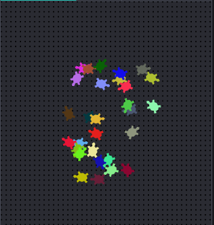

--- challenge ---

Can you define a `randomheading()` function that will make the turtle point in a random direction and make the following code work?

--- code ---
---
language: python
filename: main.py
line_numbers: true
line_number_start: 29
line_highlights: 
---
for i in range(1, 30):
    randomcolour()
    randomplace()
    randomheading()
    stamp()
--- /code ---

Hints:

- `setheading(<number>)` will change the direction the turtle is facing in.

- `<number>` should be between 1 and 360 (the number of degrees in a circle)

- You can use `randint(1, 360)` to choose a number between 1 and 360.

## Challenge: More modern art

Can you create a function that draws a shape and calls your `randomcolour()` and / or `randomplace()` functions? 

You can call your function from inside a `for` loop as you did in the rectangle art to generate modern art. 

Ideas:

- Turtles have a function called dot that takes a radius (distance from the centre to the edge of the circle) as input. E.g. turtle.dot(10) You could create a `drawcircle()` function that draws a circle with a random radius. 
    
    
    
- Look in `snippets.py` for example code to draw stars with the turtle.
    
     

--- /challenge ---