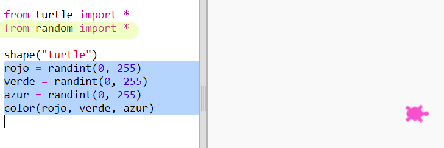

## Colores aleatorios

+ Abre este Trinket: <a href="https://trinket.io/python/b9fe277238" target="_blank">trinket.io/python/b9fe277238</a>.

+ Puedes definir el color de la tortuga diciendo cuánto rojo, verde y azul te gustaría que tuviera, del 0 al 255.
    
    Añade el siguiente código para obtener una tortuga violeta:
    
    
    
    El violeta se hace mezclando el rojo y el azul.

--- collapse ---
---
title: "Error - bad color sequence: (150, 0, 150)"
---

¿Te aparece el error `bad color sequence: (150, 0, 150)` cuando ejecutas tu código?.

Esto se debe a que Trinket utiliza un modo de color diferente al de otros editores de Python. Se puede solucionar cambiando el `colormode` (modo de color) a `255`.

```python
from turtle import *

colormode(255)

shape("turtle")
color(150,0,150)
```

--- /collapse ---

+ Prueba con números diferentes para obtener diferentes colores.
    
    Recuerda que cada número puede ser del 0 al 255.

+ ¿Y si elegimos un color aleatorio?
    
    Actualiza el código para elegir un número aleatorio entre 0 y 255 para los valores rojo, verde y azul:
    
    

+ Haz clic en 'Run' varias veces para obtener tortugas de diferentes colores.

+ ¡Qué divertido! Pero es mucho texto para recordar y escribir cada vez que quieres asignarle a la tortuga un color aleatorio, y además no es muy fácil de leer.
    
    En Python podemos escribir `def` para definir una función a la que podamos llamar cada vez que necesitemos asignar a la tortuga un color aleatorio.
    
    Ya has estado haciendo llamadas a funciones, `color()` y `randint()` son funciones que vienen predefinidas.
    
    Vamos a poner en una función el código para el color aleatorio usando def:
    
    
    
    Asegúrate de poner una sangría al código dentro de la función. Las funciones generalmente se colocan en la parte superior del código, justo después de los import.

+ Si ejecutas el código ahora con 'Run', no obtendrás una tortuga de color aleatorio. Esto se debe a que has definido su función, pero aún no la has llamado.

+ Añade una línea para llamar a tu nueva función:
    
    
    
    Observa que el nuevo código es mucho más fácil de entender porque la parte compleja se encuentra en la función. Es fácil entender qué hace `color_aleatorio()`.