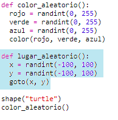
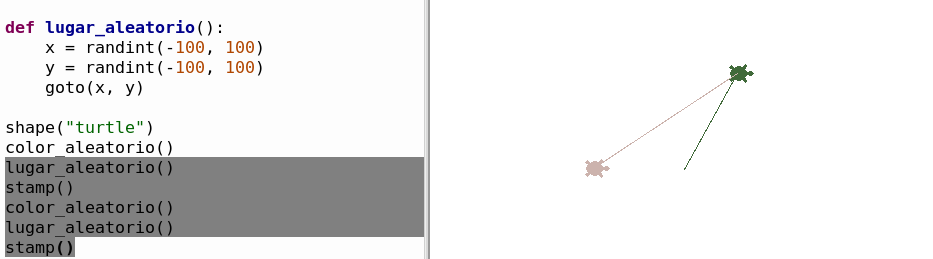
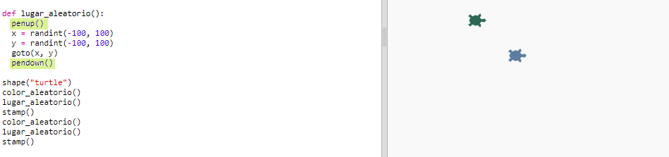

## Lugar aleatorio

Vamos a crear otra función para mover la tortuga a un lugar aleatorio de la pantalla. El centro de la pantalla es (0,0) así que colocaremos las tortugas en un área cuadrada alrededor del centro.

+ Añade la función `randomplace()`:
    
    

+ Prueba la nueva función llamándola y llamando a continuación a `stamp()`, puedes llamarla más de una vez:
    
    

+ ¡Fíjate! La tortuga dibuja una línea cuando se mueve. Vamos a levantar el bolígrafo al principio y bajarlo al final para que la tortuga no dibuje la línea mientras se mueve:
    
    
    
    ¿Te has dado cuenta de que tienes que 'arreglar' el código solo en un lugar? Eso es otra cosa buena de las funciones.

+ Ahora prueba tu código unas cuantas veces.