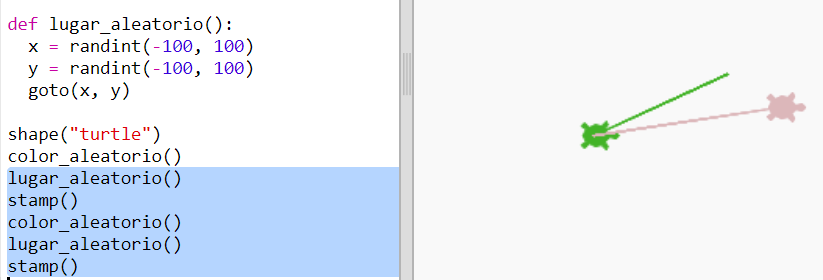

## Lugar aleatorio

Creemos otra función que mueva la tortuga a un lugar aleatorio de la pantalla. El centro de la pantalla es (0,0), por lo que colocaremos a las tortugas en un cuadrado alrededor del centro. 

+ Añade una función `randomplace()`:

    
    
+ Prueba tu nueva función recuperándola y recuperando `stamp()`; puedes recuperarla más de una vez:

    

+ ¡Ohhh!, la tortuga dibuja mientras se mueve. Subamos el lápiz al principio y al final de modo que la tortuga no dibuje mientras se mueve: 

    
    
    ¿Has notado que solamente tienes que arreglar el código en un solo lugar? Esta es otra de las ventajas de las funciones. 

+ Ahora prueba tu código varias veces.

