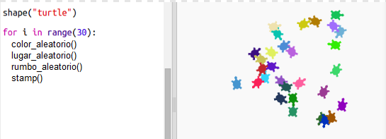

--- challenge ---
## Reto: Arte de tortuga 
¿Puedes definir una función `randomheading()` que haga que la tortuga apunte en una dirección aleatoria y lograr que el siguiente código funcione?

Sugerencias:

- `setheading(<number>)` cambiará la dirección de la tortuga.

- `<number>` debe encontrarse entre 1 y 360 (los grados de un círculo)

- Puedes usar `randint(1, 360)` para seleccionar un número entre 1 y 360.

--- /challenge ---