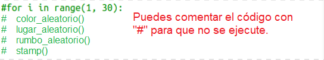
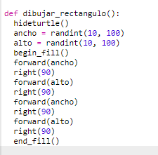
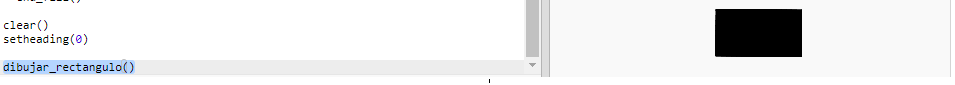
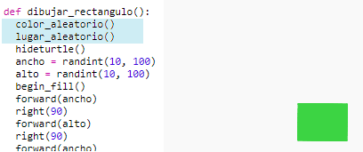

## Crea arte moderno rectangular

Creemos arte moderno dibujando muchos rectángulos de distintos tamaños y colores. 

+ En primer lugar, añade el siguiente código en la parte inferior de tu script, después de tu código reto, para borrar la pantalla y orientar la tortuga en la dirección estándar:

    

+ Puedes comentar el código de arte de tortuga colocando una `#` al principio de cada línea de modo que no se ejecute mientras trabajas en el rectángulo. (A continuación, podrás eliminar el comentario para mostrar completamente tu obra de arte).

    
 
+ ¡Añadamos una función que dibuje un rectángulo de color y tamaño aleatorios en una ubicación aleatoria! 
    
    Añade una función `drawrectangle()` después de las otras funciones:

    
    
    Consulta `snippets.py` parar lograr asistencia con los códigos si quieres ahorrar tiempo escribiendo. 
    
+ Añade el siguiente código a la parte inferior de `main.py` para recuperar tu nueva función:

    
    
    Ejecuta tu script un par de veces para ver los cambios de altura y anchura. 
   
+ El rectángulo siempre es del mismo color y comienza siempre en la misma ubicación. 

    Ahora necesitarás asignar a la tortuga un color aleatorio y moverla a un lugar aleatorio. ¡Un momento!, ¿no has creado ya funciones que lo hagan? Fantástico. Simplemente recupéralas desde el principio de la función 'drawrectangle': 
    
    
    
    Increíble. ¡Casi no ha costado nada y es mucho más fácil de leer! 

    
+ Ahora, recuperemos `drawrectangle()` en un bucle para crear increíbles obras de arte moderno.

    

+ Vaya, un poco lento ¿verdad? Afortunadamente puedes hacer que la tortuga vaya más rápido. 

    Encuentra la línea en donde estableciste la forma de la tortuga y añade el código marcado: 
    
    
    
    `speed(0)` es la velocidad más rápida; o puedes usar números entre 1 (lento) y 10 (rápido). Experimenta hasta que encuentres la velocidad deseada. 
