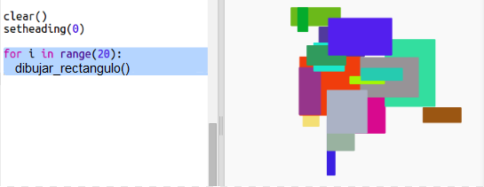

## Crea arte moderno rectangular

Ahora vamos a crear arte moderno dibujando muchos rectángulos de diferentes tamaños y colores.

+ En primer lugar, añade el siguiente código al final del script, después del código del reto, para limpiar la pantalla después crear tu arte con tortugas, y para que la tortuga apunte en su dirección habitual:
    
    

+ Puedes comentar el código de arte con tortugas colocando un `#` al comienzo de cada línea para que esa línea no se ejecute mientras trabajas en tu creación de arte rectangular. (Puedes descomentarlo más tarde para mostrar todo tu trabajo).
    
    

+ ¡Vamos a añadir una función para dibujar un rectángulo de tamaño aleatorio de color aleatorio y en una ubicación aleatoria!
    
    Añade la función `drawrectangle()` después de las funciones que ya has añadido:
    
    
    
    Investiga en `snippets.py` para hallar código de utilidad si quieres ahorrarte tiempo tecleando.

+ Añade el siguiente código en la parte inferior de `main.py` para llamar a la nueva función:
    
    
    
    Ejecuta tu script varias veces para ver el cambio de altura y anchura.

+ El rectángulo siempre tiene el mismo color y se sitúa en la misma ubicación.
    
    Ahora tendrás que definir un color aleatorio para la tortuga y, a continuación, moverla a un lugar aleatorio. Pero... ¿no has creado antes funciones para hacer eso? ¡Genial! Puedes llamar las desde el comienzo de la función drawrectangle:
    
    
    
    ¡Muy bien! Nos hemos ahorrado trabajo y es mucho más fácil de leer.

+ Vamos a llamar a `drawrectangle()` en un bucle para crear arte moderno alucinante:
    
    

+ Caramba, es un poco lento, ¿no? Afortunadamente puedes hacer que la tortuga vaya más rápida.
    
    Encuentra la línea donde das forma a 'tortuga' y añade el código resaltado:
    
    
    
    `speed(0)` es la velocidad más rápida. Puedes usar los números del 1 (lento) al 10 (rápido). Haz pruebas hasta encontrar la velocidad que te guste.