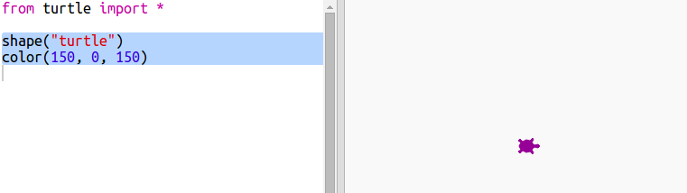

## Colores aleatorios

+ Abre este trinket: <a href="http://jumpto.cc/modern-go" target="_blank">jumpto.cc/modern-go</a>.

+ Puedes determinar el color de una tortuga indicando qué tan roja, verde y azul quisieras que sea desde 0 a 255.
    
    Añade el siguiente código para obtener una tortuga morada:
    
    
    
    El morado se obtiene mezclando rojo y azul.

## \--- collapse \---

## title: "Error - mala secuencia de colores: (150, 0, 150)"

¿Te aparece el error `mala secuencia de colores: (150, 0, 150)` cuando ejecutas tu código?

Esto se debe a que Trinket usa un modo de color diferente a otros editores Python. Se puede solucionar cambiando el `colormode` a `255`.

```python
from turtle import *

colormode(255)

shape("turtle")
color(150,0,150)
```

\--- /collapse \---

+ Prueba diferentes números para obtener diferentes colores.
    
    Recuerda que cada número puede ser desde 0 a 255.

+ ¿Qué tal si escoges un número al azar?
    
    Actualiza tu código para escoger un número al azar entre 0 y 255 para los valores de rojo, verde y azul:
    
    

+ Haz click en "Run" un par de veces para obtener tortugas de diferentes colores.

+ Es divertido, pero es demasiado para recordar y escribir cada vez que quieras asignar un color al azar a una tortuga y no es tan fácil de leer.
    
    En Python, podemos escribir `def` para definir una función que podamos requerir cada vez que necesitemos asignar una tortuga con un color aleatorio.
    
    Ya has estado llamando funciones, `color()` y `randint()` son funciones que han sido definidas por ti.
    
    Pongamos el código del color aleatorio en una función usando def:
    
    
    
    Asegúrate de indentar el código dentro de una función. Las funciones generalmente se colocan en la parte superior del código, después de los imports.

+ Si ejecutas el código con "Run" ahora mismo no obtendrás una tortuga con un color al azar. Esto se debe a que has definido la función, pero todavía no la has llamado.

+ Añade una línea para llamar a tu nueva función:
    
    
    
    Nota cómo tu nuevo código es mucho más fácil de entender ya que la parte complicada ahora está dentro de la función. It’s easy to work out what `randomcolour()` does.