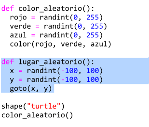
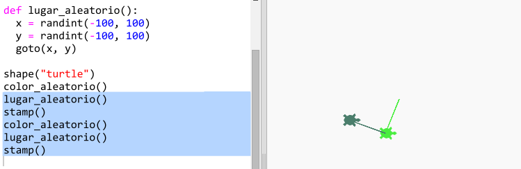
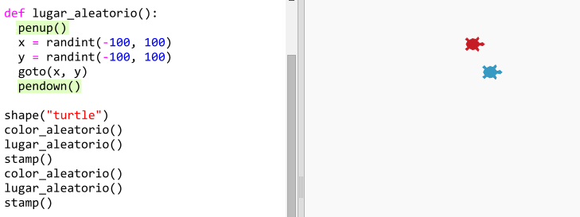

## Lugar aleatorio

Vamos a crear otra función para mover la tortuga a un lugar aleatorio en la pantalla. El centro de la pantalla es (0,0), así que vamos a colocar tortugas en un área cuadrada alrededor del centro.

+ Añade la función `lugar_aleatorio()`:
    
    

+ Prueba tu nueva función llamándola y luego llamando a la función `stamp()`, puedes invocarlas más de una vez:
    
    

+ Vaya, la tortuga dibuja cuando se mueve. Vamos a levantar el lapicero al inicio y bajarlo al final para que la tortuga no dibuje mientras se mueve:
    
    
    
    ¿Te has dado cuenta de que has tenido que 'arreglar' el código solo en un lugar? Esta es otra cosa buena de las funciones.

+ Ahora prueba tu código unas cuentas veces.