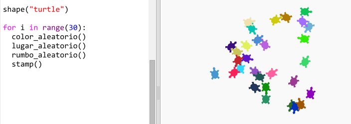

\--- challenge \---

## Desafío: Turtle art

¿Puedes definir la función `randomheading()` para que la tortuga apunte en una dirección aleatoria y hacer que el siguiente código funcione?

Pistas:

- `setheading(<number>)` cambiará la dirección en la que la tortuga está viendo.

- `<number>` debería estar entre 1 y 360 (el número de grados en un círculo)

- Puedes usar `randint(1, 360)` para elegir un número entre 1 y 360.

\--- /challenge \---