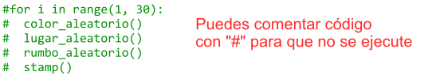
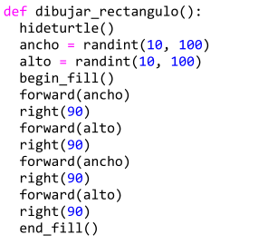
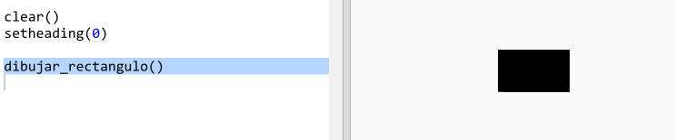
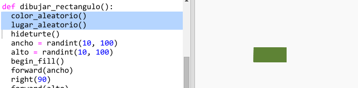
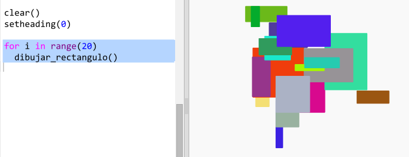

## Crea arte moderno rectangular

Ahora vamos a crear arte moderno dibujando muchos rectángulos de diferentes tamaños y colores.

+ En primer lugar, añade el siguiente código después del código del desafío para limpiar la pantalla después de crear tu arte con tortugas y para que la tortuga apunte en su dirección habitual:
    
    

+ Puedes comentar el código de "arte con tortugas" colocando un `#` al comienzo de cada línea para que esa línea no se ejecute mientras trabajas en tu "creación de arte rectangular". (Puedes quitar estos comentarios luego para mostrar todo tu trabajo)
    
    

+ ¡Vamos a añadir una función para dibujar un rectángulo de tamaño y color aleatorio en una ubicación aleatoria!
    
    Añade una función `dibujar_rectangulo()` después de las funciones que ya has añadido:
    
    
    
    Busca en `snippets.py` para hallar código de ayuda si quieres ahorrarte tiempo tecleando.

+ Añade el siguiente código al final de `main.py` para llamar a tu nueva función:
    
    
    
    Ejecuta tu script unas cuantas veces para mirar el cambio en el largo y ancho.

+ El rectángulo siempre tiene el mismo color y se sitúa en la misma ubicación.
    
    Ahora tendrás que definir un color aleatorio para la tortuga y, a continuación, moverla a un lugar aleatorio. Pero... ¿no habías creado antes funciones para hacer eso? ¡Genial! Simplemente puedes llamarlas desde el comienzo de la función dibujar_rectangulo:
    
    
    
    ¡Bien! Nos ahorramos bastante trabajo y ahora es mucho más fácil de leer.

+ Ahora, llamemos a `dibujar_rectangulo()` en un bucle para crear arte moderno alucinante:
    
    

+ Caramba, es un poco lento, ¿no? Afortunadamente, puedes hacer que la tortuga vaya más rápido.
    
    Encuentra la línea donde fijas la forma de "tortuga" y añade el código resaltado:
    
    
    
    `speed(0)` es la velocidad más rápida, o puedes usar números desde el 1 (lento) al 10 (rápido). Experimenta hasta que encuentres tu velocidad preferida.