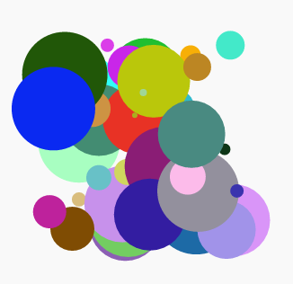

\--- challenge \---

## Desafío: Más arte moderno

¿Puedes crear una función que dibuje una forma y llame a tus funciones `randomcolour()` y o `randomplace()`?

Puedes llamar tu función desde dentro de un bucle `for` tal como lo hiciste con el arte rectangular para generar arte moderno.

Ideas:

- Las tortugas tienen una función llamada "dot" que toma el radio (distancia desde el centro al borde del círculo) como entrada. Por ejemplo, turtle.dot(10). Puedes crear una función `drawcircle()` que dibuja un círculo con un radio aleatorio.
    
    

- Busca en `snippets.py` para ejemplos de código para dibujar estrellas con la tortuga.
    
    

\--- /challenge \---