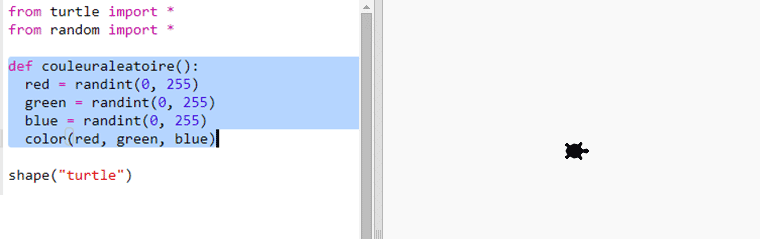
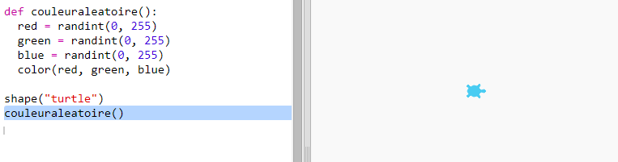

## Couleurs aléatoires

+ Ouvre ce trinket: <a href="https://trinket.io/python/ea6605639f" target="_blank">jumpto.cc/modern-go</a>.

+ Tu peux définir la couleur de la tortue en disant quelle quantité de rouge, de bleu ou de vert tu veux entre 0 et 255.
    
    Ajoute le code suivant pour obtenir une tortue mauve:
    
    
    
    Le mauve est fait en mélangeant le rouge et le bleu.

--- collapse ---
---
title: "Erreur - mauvaise séquence de couleurs: (150, 0, 150)"
---

Obtiens-tu l'erreur `séquence de couleurs incorrecte: (150, 0, 150)` lors de l'exécution de ton code.

C'est parce que trinket utilise un mode de couleur différent pour d'autres éditeurs Python. Il peut être corrigé en changeant le `mode couleur` en `255`.

```python
from turtle import *

colormode(255)

shape("turtle")
color(150,0,150)
```

--- /collapse ---

+ Essaye des nombres différents pour obtenir des couleurs différentes.
    
    N'oublie pas que chaque numéro doit être compris entre 0 et 255.

+ Que dirais-tu de prendre des couleurs aléatoires?
    
    Met à jour ton code pour choisir un nombre aléatoire compris entre 0 et 255 pour les valeurs rouge, verte et bleue:
    
    

+ Clique sur "Exécuter" plusieurs fois pour obtenir différentes tortues colorées.

+ C'est amusant, mais cela fait beaucoup à retenir et à taper à chaque fois que tu veux définir une tortue à une couleur aléatoire et ce n'est pas très facile à lire.
    
    Dans Python, nous pouvons écrire `def` pour définir une fonction que nous pouvons appeler chaque fois que nous devons définir la tortue à une couleur aléatoire.
    
    Tu as déjà appelé des fonctions, `color() ` et `randint()` sont des fonctions qui ont été définies pour toi.
    
    Mettons le code de couleur aléatoire dans une fonction en utilisant def:
    
    
    
    Assures-toi de mettre une indentation dans le code de la fonction. Les fonctions sont généralement placées en haut du script après les importations.

+ Si tu exécutes (Run) ton code maintenant tu n'obtiendras pas une tortue colorée aléatoirement. C'est parce que tu as défini ta fonction, mais tu ne l'as pas encore appelée.

+ Ajoute une ligne pour appeler ta nouvelle fonction:
    
    
    
    Note que ton nouveau code est beaucoup plus facile à comprendre car la partie complexe est dans la fonction. C'est facile de comprendre ce que `couleuraleatoire()` fait.