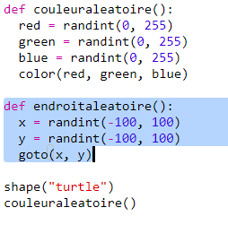
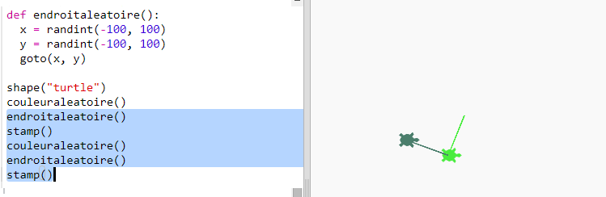
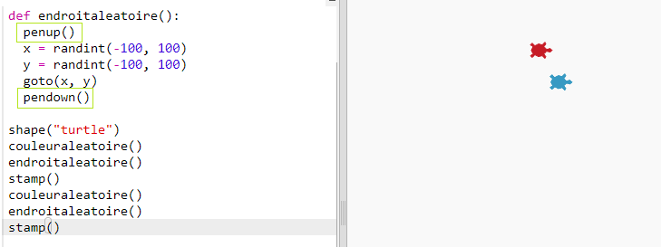

## Emplacement aléatoire

Créons une autre fonction pour déplacer la tortue vers un point aléatoire à l'écran. Le centre de l'écran est (0,0) donc nous allons placer les tortues dans un carré autour du centre.

+ Ajoute une fonction `randomplace()` :

    

+ Essaie ta nouvelle fonction en l'appelant puis en appeant `stamp()`, tu peux l'appeler plus d'une fois :

    

+ Ooops, la tortue écrit quand elle se déplace. Mettons le stylo en position relevée au début puis en position baissée à la fin pour que la tortue n'écrive pas pendant son déplacement :

    

    As-tu remarqué que tu as dû 'corriger' le code à un seul endroit ? C'est encore quelquechose de très appréciable à propos des fonctions.

+ Maintenant teste ton code plusieurs fois.

