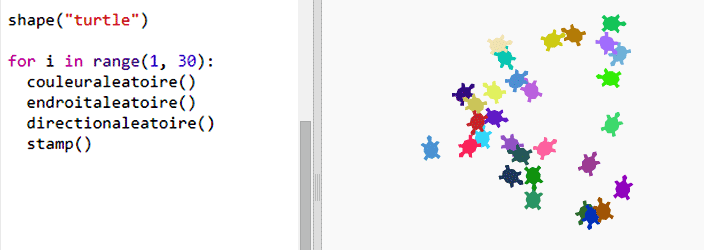

--- challenge ---
## Défi : Art tortuesque 
Peux-tu définir une fonction `randomheading()` qui va faire pointer la tortue dans une direction aléatoire et faire marcher le code suivant ?

Indices :

- `setheading(<number>)` changera la direction dans laquelle la tortue se trouve.

- `<number>` devrait être un chiffre entre 1 et 360 (le nombre de degrés dans un cercle)

- Tu peux utiliser `randint(1, 360)` pour choisir un nombre entre 1 et 360.

--- /challenge ---