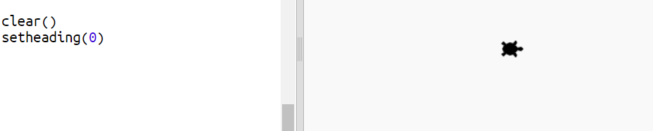
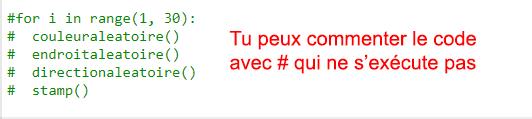
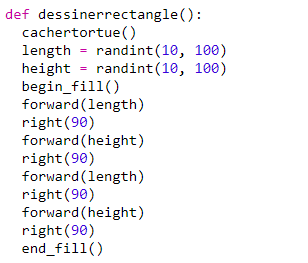
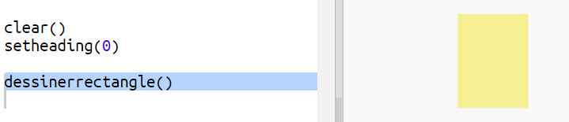
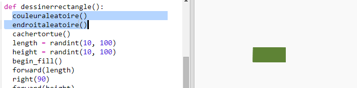
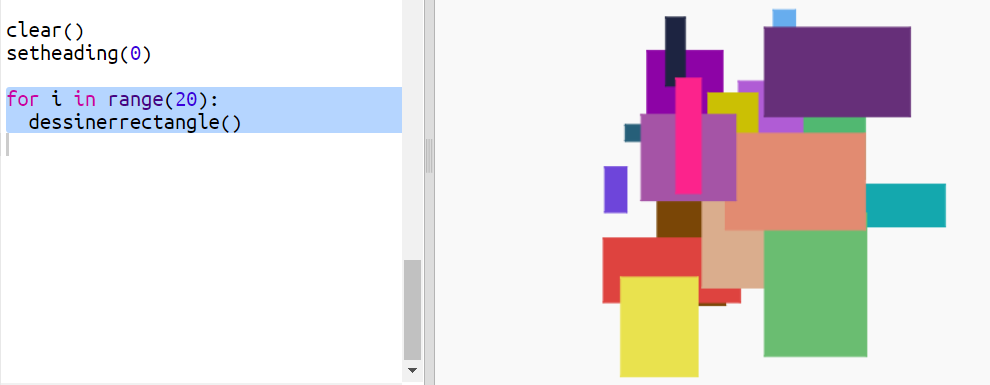

## Créer de l'art moderne rectangulaire

Maintenant créons de l'art moderne en dessinant beaucoup de rectangles de différentes tailles et différentes couleurs.

+ Dans un premier temps, ajoute le code suivant à la fin de ton script, après celui de ton défi, pour réinitialiser l'écran de ta précédente œuvre et pour que la tortue pointe vers sa direction habituelle:
    
    

+ Tu peux commenter le code de ta propre tortue en plaçant un `#` devant le début de chaque ligne de manière à ce qu'il ne soit pas exécuté par la machine pendant que tu travailles sur tes rectangles. (Après tu pourras le dé-commenter pour montrer tout ton travaille)
    
    

+ Maintenant ajoutons une fonction qui dessine des rectangles de taille, de couleur et à une position aléatoire!
    
    Ajoute une fonction `dessinerectangle()` après tes autres fonctions:
    
    
    
    Regarde dans `snippets.py` pour quelque code d'aide si tu as envie d'économiser du temps de codage.

+ Ajoute le code suivant à la fin de ton fichier `main.py` pour appeler tes nouvelles fonctions:
    
    
    
    Exécute ton script plusieurs fois pour voir les variations de hauteur et de largeur des rectangles.

+ Le rectangle est toujours de la même couleur et commence à la même position.
    
    Maintenant tu auras besoin de définir une couleur aléatoire à ta tortue pour ensuite la déplacer à une position au hasard. Hé, mais n'as tu pas déjà créer des fonctions pour réaliser ces tâches ? Fantastique. Tu peux simplement les appeler au début de ta fonction dessinerectangle:
    
    
    
    Wouah, c'était beaucoup moins de travail, et plus facile à lire.

+ Appelons maintenant `dessinerectangle()` dans une boucle pour créer de l'art moderne cool:
    
    

+ Oula, c'est un peu lent, tu ne trouves pas? Heureusement, tu peux accélérer la tortue.
    
    Trouve la ligne où tu peux définir la forme en "tortue" et ajoute le code surligné:
    
    
    
    `speed(0)` est le plus rapide ou utilise un nombre entre 1 (lent) à 10 (rapide). Expérimente jusqu'à ce que tu trouve la vitesse que tu aimes.