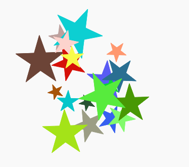

--- challange ---

## Défi: plus d'art moderne

Peux tu créer une fonction qui dessine une forme et qui appelle ta fonction `couleuraleatoire()` et/ou ta fonction `endroitaleatoire()`?

Tu peux appeler ta fonction à l'intérieur d'une boucle `for` comme tu l'as fait pour tes œuvres avec les rectangles pour générer de l'art moderne.

Idées:

- Les tortues ont une fonction appelée dot qui prennent un rayon (distance entre le centre et le bord du cercle) comme paramètre. Par exemple tortue.dot(10) Tu peux créer une fonction `dessinecercle()` qui dessine des cercles avec un rayon aléatoire.
    
    

- Regarde dans `snippets.py` pour un exemple de code pour dessiner des étoiles avec les tortues.
    
    

--- /challenge ---

**Traduction de la communauté**

Ce projet a été traduit par **Simon Gleises** et vérifié par **Jonathan Vannieuwkerke**.

Nos incroyables bénévoles de traduction nous aident à donner aux enfants du monde entier la chance d'apprendre à coder. Vous pouvez nous aider à atteindre plus d'enfants en traduisant nos projets - en savoir plus sur [rpf.io/translators](https://rpf.io/translators).