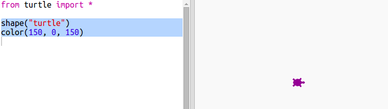

## बेतरतीब रंग

+ इस ट्रिंकेट को खोलें: <a href="http://jumpto.cc/modern-go" target="_blank">jumpto.cc/modern-go</a>. 

+ आप 0 से 255 के बीच अपनी इच्छा से लाल, हरे और नीले रंग की मात्रा का चयन करके टर्टल का रंग निर्धारित कर सकते हैं। 

    बैंगनी रंग के टर्टल के लिए निम्नलिखित कोड जोड़ें:

    
   
    बैंगनी रंग लाल और नीले को मिश्रित करके बनता है।

+ भिन्न-भिन्न रंग बनाने के लिए भिन्न-भिन्न संख्याएँ आज़माएँ। 

    याद रखें कि प्रत्येक संख्या 0 से 255 के बीच हो सकती है। 

+ बेतरतीब रंग का चयन करने के बारे में क्या ख़्याल है?

    लाल, हरे और नीले रंग के मान के लिए 0 और 255 के बीच बेतरतीब संख्या का चयन करने के लिए, अपने कोड को अपडेट करें:
    
    

+ भिन्न-भिन्न रंगों के टर्टल प्राप्त करने के लिए कुछ बार ‘Run’ पर क्लिक करें।

+ यह मज़ेदार है, परन्तु जब आप बेतरतीब रंग में टर्टल को सेट करना चाहते हैं तो याद रखने योग्य और टाइप करने के लिए बहुत कुछ होता है और पढ़ने में यह बहुत आसान नहीं होता है। 

    Python में हम फंक्शन को परिभाषित करने के लिए `def` लिख सकते हैं, जिसे हम बेतरतीब रंग का टर्टल सेट करने की आवश्यकता होने पर कॉल कर सकते हैं। 

    आप पहले से ही फंक्शन्स को कॉल कर रहे हैं, `color()` (रंग) और `randint()` आपके लिए परिभाषित किए गए फंक्शन हैं। 

    चलिए def का उपयोग करके फंक्शन में बेतरतीब रंग कोड डालें:
  
    
    
  सुनिश्चित करें कि आप फंक्शन के भीतर कोड इंडेंट करते हैं। इम्पोर्ट के बाद फंक्शन अक्सर स्क्रिप्ट के ऊपर होते हैं। 
  
+ यदि आप अब अपने कोड को ‘रन’ करते हैं, तो आपको बेतरतीब रंग का टर्टल प्राप्त नहीं होता। ऐसा इसलिए है क्योंकि आपने अपना फंक्शन परिभाषित कर लिया है, परन्तु अभी तक इसे कॉल नहीं किया। 
  
+ अपने नए फंक्शन को कॉल करने के लिए पंक्ति जोड़ें:
  
    

    ध्यान दें कि आपका नया कोड समझने में बहुत सरल है, क्योंकि जटिल भाग फंक्शन में निहित है। `randomcolour()` (बेतरतीब रंग) का काम समझना कठिन होता है।

