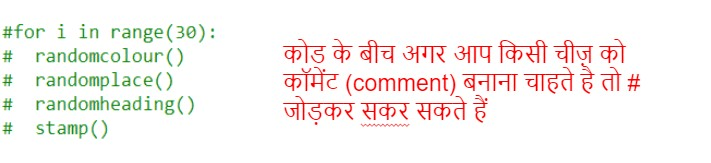

## आयत मॉडर्न आर्ट बनाएँ

चलिए अब विभिन्न आकारों और रंगों के कई आयत बनाकर मॉडर्न आर्ट बनाएँ। 

+ अपने टर्टल आर्ट के बाद स्क्रीन को क्लियर करने और टर्टल को इसकी सामान्य दिशा में लाने के लिए, अपने चुनौती कोड के बाद अपनी स्क्रिप्ट के नीचे निम्नलिखित कोड जोड़ें:

    

+ आप प्रत्येक पंक्ति के आरंभ में `#` शामिल करके अपने टर्टल आर्ट पर कमेंट सकते हैं ताकि आपके द्वारा आयत आर्ट पर काम करते समय यह रन न होजोड़ । (फिर आप अपना काम दिखाने के लिए इसे अनकमेन्ट कर सकते हैं।)

    
 
+ चलिए अब बेतरतीब स्थान पर बेतरतीब आकार, बेतरतीब रंग का आयत बनाने के लिए फंक्शन जोड़ें! 
    
    अपने अन्य फंक्शन्स के आगे `drawrectangle()` (आयत बनाएँ) फंक्शन जोड़ें:

    
    
    यदि आप टाइप करने का कुछ समय बचाना चाहते हैं, तो सहायक कोड के लिए `snippets.py` देखें। 
    
+ अपने नए फंक्शन को कॉल करने के लिए `main.py` के नीचे निम्नलिखित कोड जोड़ें:

    
    
    उंचाई और चौड़ाई में परिवर्तन देखने के लिए, अपनी स्क्रिप्ट को कुछ बार रन करें। 
   
+ आयत हमेशा समान रंग का होता है और समान स्थान पर ही आरंभ होता है। 

    अब आपको टर्टल में बेतरतीब रंग सेट करना होगा और फिर इसे बेतरतीब स्थान पर स्थानांतरित करना होगा। अरे, क्या आप पहले से ही ऐसा करने के लिए फ़ंक्शन नहीं बनाए हैं? बहुत बढ़िया। आप उन्हें बस drawrectangle फ़ंक्शन के आरंभ से कॉल कर सकते हैं: 
    
    
    
    वाह यह तो बहुत छोटा काम था, और पढ़ने में यह बहुत सरल है। 

    
+ चलिए अब आकर्षक मॉडर्न आर्ट बनाने के लिए `drawrectangle()` को लूप में कॉल करें:

    

+ हे भगवान यह कुछ धीमा था, है न! सौभाग्यवश आप टर्टल की गति बढ़ा सकते हैं। 

    उस पंक्ति को ढूंढें जहाँ आप 'turtle' की आकृति सेट की थी और हाइलाइट किया गया कोड जोड़ें:
    
    
    
    `speed(0)` (गति(0)) सबसे तेज़ है या आप 1 (धीमे) से 10 (तीव्र) तक संख्याओं का उपयोग कर सकते हैं। तब तक प्रयोग करना जारी रखें, जब तक आपको आपकी पसंद की गति प्राप्त न हो जाए। 

