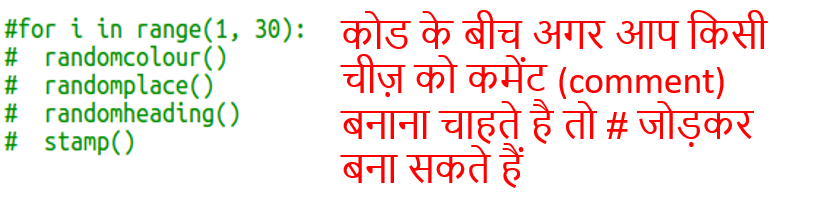

## आयत मॉडर्न आर्ट बनाएँ

अब विभिन्न आकारों और रंगों के बहुत सारे आयतों को खींचकर कुछ आधुनिक कला का निर्माण करते हैं।

+ अपने कछुए कला के बाद स्क्रीन को खाली करने और कछुए को अपनी सामान्य दिशा में इंगित करने के लिए, अपनी चुनौती कोड के बाद, अपनी स्क्रिप्ट के नीचे निम्नलिखित कोड को पहले जोड़ें:
    
    

+ आप प्रत्येक पंक्ति की शुरुआत में एक `#` रखकर अपने कछुए कला कोड को कमेंट कर सकते हैं जब आप आयत कला पर काम कर रहे हो ताकि कछुआ कला वाला कोड ना चले। (तब आप बाद में अपने सभी कामों को दिखाने के लिए इसे हटा सकते हैं।)
    
    

+ अब एक यादृच्छिक स्थान पर एक यादृच्छिक आकार, यादृच्छिक रंग का आयत बनाने के लिए एक फ़ंक्शन जोड़ें!
    
    अपने अन्य फंक्शन्स के बाद कार्य एक `drawrectangle()`फंक्शन जोड़ें:
    
    
    
    यदि आप कुछ टाइपिंग समय बचाना चाहते हैं तो `snippets.py` में कुछ सहायक कोड के लिए देखें।

+ अपने नए फ़ंक्शन को कॉल करने के लिए निम्न कोड को `main.py` के नीचे जोड़ें:
    
    
    
    ऊंचाई और चौड़ाई में परिवर्तन देखने के लिए अपनी स्क्रिप्ट को कुछ बार चलाएं।

+ आयत हमेशा एक ही रंग की होती है और एक ही स्थान पर शुरू होती है।
    
    अब आपको कछुए को यादृच्छिक रंग में सेट करना होगा और फिर इसे यादृच्छिक स्थान पर ले जाना होगा। अरे, क्या आपने पहले से ही ऐसा करने के लिए फ़ंक्शंस नहीं बनाए थे? लाजवाब! आप उन्हें ड्रारेक्टैंगल फंक्शन की शुरुआत से बुला सकते हैं:
    
    
    
    वाह बहुत कम काम था, और इसे पढ़ना बहुत आसान है।

+ अब चलो आधुनिक कला बनाने के लिए `drawrectangle()` एक लूप में कॉल करें:
    
    

+ थोड़ा धीमा था ना! सौभाग्य से आप कछुए को गति दे सकते हैं।
    
    वह रेखा ढूंढें जहाँ आपने आकृति को 'कछुए' पर सेट किया है और हाइलाइट किया गया कोड जोड़ें:
    
    
    
    `speed(0)` सबसे तेज़ है, आप 1 (धीमी) से लेकर 10 (तेज़) तक की संख्याओं का उपयोग कर सकते हैं, तब तक प्रयोग करें जब तक आपको अपनी पसंद की गति न मिल जाए।