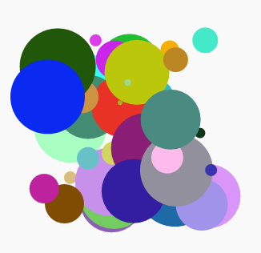

## Uvod

U ovom projektu naučit ćeš pomoću računala napraviti modernu umjetnost. Pomoću funkcija napisat ćeš kôd koji ćeš moći koristiti kad god budeš htio.

  <iframe src="https://trinket.io/embed/python/47bbc2fc2b?outputOnly=true&start=result" width="600" height="500" frameborder="0" marginwidth="0" marginheight="0" allowfullscreen>
  </iframe>
  

### Dodatne informacije za voditelje kluba

Ako želite ispisati ovaj projekt, molimo Vas da koristite [verziju koja je prilagođena za ispis](https://projects.raspberrypi.org/en/projects/modern-art/print).

## \--- collapse \---

## title: Bilješke za voditelja kluba

## Uvod:

U ovom projektu se pomoću generatora za šaroliku modernu umjetnost uči o funkcijama. U funkcije spremamo koristan kôd turtle grafike koji zatim možemo s lakoćom koristiti za stvaranje zanimljive umjetnosti.

## Online izvori

**U ovom projektu koristi se Python 3.** Predlažemo korištenje [trinketa](https://trinket.io/) za online pisanje u Pythonu. Ovaj projekt sadrži sljedeće Trinkete:

* ['Moderna umjetnost' početni projekt -- jumpto.cc/modern-go](http://jumpto.cc/modern-go)

Također je uključen i trinket koji sadrži prijedlog rješenja izazova:

* ['Moderna umjetnost' dovršeni projekt -- rpf.io/modern-finished](https://rpf.io/modern-finished)

## Offline izvori

Ako želite, ovaj projekt može bit [završen offline](https://www.codeclubprojects.org/en-GB/resources/python-working-offline/). Materijalima projekta možete pristupiti klikom na poveznicu 'Project Materials'. Poveznica sadrži odjeljak 'Project Resources' u kojem se nalaze materijali koji će djeci biti potrebni za izradu projekta offline. Pobrinite se da svako dijete ima pristup kopiji ovih materijala. U odjeljku se nalaze sljedeće datoteke:

* modern-art/modern-art.py
* modern-art/snippets.py

Dovršenu verziju projekta challenges možete pronaći i u odjeljku 'Volunteer Resources' koji sadrži:

* modern-art-finished/modern-art.py

(Svi spomenuti materijali nalaze se u materijalima projekta i materijalima za volontere, moguće je preuzeti kao `.zip` datoteke.)

## Ishodi učenja

* Funkcije;

This project covers elements from the following strands of the [Raspberry Pi Digital Making Curriculum](https://rpf.io/curriculum):

* [Uporaba različitih programskih struktura za rješavanje problema.](https://www.raspberrypi.org/curriculum/programming/builder)

## Izazovi

* Kornjačina umjetnost - definiranje nove funkcije za upotpunjavanje turtle generatora.
* Još moderne umjetnosti - kreiranje nove funkcije koja će pozivati ostale funkcije za generiranje moderne umjetnosti.

## Često postavljana pitanja

* Kako bi djeca izbjegla čekanje da se pokrene prethodno napisan kôd, taj dio kôda mogu komentirati koristeći znak '#' na početku linije.
* Ako žele da se cijeli kôd pokrene, mogu koristiti naredbu `clear()` za brisanje cijelog ekrana. 

\--- /collapse \---

## \--- collapse \---

## title: Materijali projekta

## Resursi projekta

* [.zip file containing all project resources](https://rpf.io/p/en/modern-art-go){:target="_blank"}
* [Online Trinket koji sadrži početne materijale projekta 'Moderna umjetnost'](http://jumpto.cc/modern-go)

## Materijali za voditelja Kluba

* [.zip file containing all completed project resources](https://rpf.io/p/en/modern-art-get){:target="_blank"}
* [Online completed Trinket project](https://trinket.io/python/47bbc2fc2b)

\--- /collapse \---