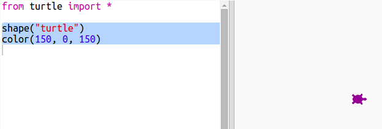

## Nasumične boje

+ Otvori ovaj trinket: <a href="http://jumpto.cc/modern-go" target="_blank">jumpto.cc/modern-go</a>.

+ Možeš podesiti boju kornjače tako da odabereš koliko želiš crvene, zelene i plave boje od 0 do 255.
    
    Dodaj sljedeći kôd kako bi tvoja kornjača bila ljubičasta:
    
    
    
    Ljubičasta se dobije miješanjem crvene i plave boje.

+ Pokušaj odabrati neke druge brojeve kako bi dobio drugačije boje.
    
    Zapamti da svaki broj može biti od 0 do 255.

+ Kako bi bilo da nasumično odaberemo boju?
    
    Izmijeni svoj kôd tako da za vrijednosti crvene, zelene i plave boje odabire nasumični broj između 0 i 255:
    
    

+ Klikni na ‘Run’ nekoliko puta da dobiješ kornjače različitih boja.

+ Zabavno je, ali i teško za zapamtiti i unositi svaki put kad želiš da se boja kornjače nasumično odredi. Također je i teško za čitati.
    
    U Pythonu možemo upisati `def` i definirati funkciju koju možemo pozvati svaki put kad želimo nasumično odabrati boju kornjače.
    
    Već smo pozivali funkcije, poput `color()` i `randint()` koje su bile unaprijed definirane.
    
    Iskoristimo def kako bi u funkciju stavili dio kôda koji nasumično određuje boju:
    
    
    
    Ne zaboravi uvući kôd unutar funkcije. Funkcije se obično pišu na početku programa, nakon naredbi import.

+ Ako sada klikneš na ‘Run’, nećeš dobiti nasumično obojenu kornjaču. To je zato što si definirao svoju funkciju, ali ju nisi pozvao.

+ Dodaj sljedeću liniju kôda za pozivanje svoje nove funkcije:
    
    
    
    Primijeti da je novi kôd puno lakši za razumijeti jer je komplicirani dio unutar funkcije. Lako je zaključiti što funkcija `nasumicnaBoja()` radi.