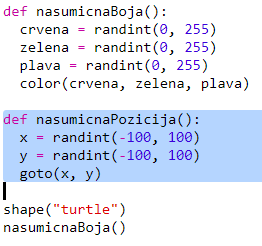
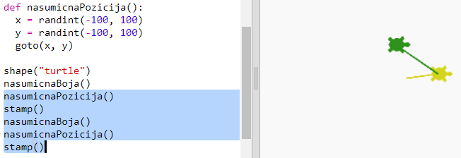
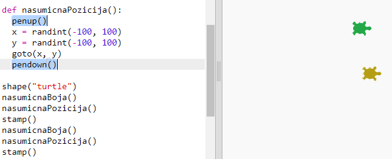

## Nasumična pozicija

Definirajmo još jednu funkciju koja će pomicati kornjaču na nasumičnu poziciju na ekranu. Sredina ekrana ima koordinate (0,0) pa ćemo kornjače smjestiti oko centra u prostor u obliku kvadrata.

+ Dodaj funkciju `nasumicnaPozicija()`:
    
    

+ Isprobaj svoju novu funkciju tako da prvo pozoveš nju, a zatim funkciju `stamp()`. Možeš ju pozvati više puta:
    
    

+ Uuups, kornjača crta dok se pomiče. Podignimo olovku na početku i spustimo ju na kraju tako da kornjača ne crta dok se pomiče:
    
    
    
    Primjećuješ li da je kôd morao biti 'popravljen' samo na jednom mjestu? To je još jedna prednost funkcija.

+ Testiraj sada svoj kôd nekoliko puta.