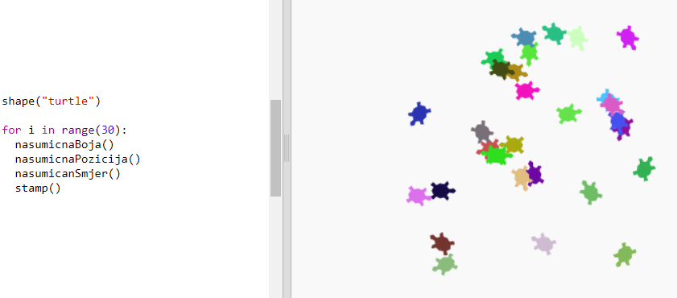

--- challenge ---

## Izazov: Kornjačina umjetnost

Možeš li definirati funkciju `nasumicanSmjer()` kojom će kornjača pokazivati u nasumičnom smjeru i koja će učiniti da sljedeći kôd radi?

Pomoć:

- `setheading(<number>)` će promijeniti smjer u kojem je kornjača okrenuta.

- `<number>` mora biti između 1 i 360 (broj stupnjeva unutar kruga).

- Možeš koristiti `randint(1, 360)` za odabir broja između 1 i 360.

--- challenge ---