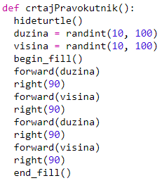
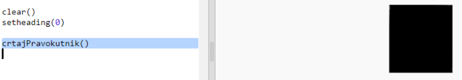

## Kreiraj modernu umjetnost s pravokutnicima

Kreirajmo sada modernu umjetnost crtajući puno pravokutnika različitih boja i veličina.

+ Prvo dodaj sljedeći kôd na kraj svog programa, nakon kôda koji si napisao dok si rješavao izazov. Tako ćeš očistiti ekran od crteža koje je napravila tvoja kornjača i usmjerit ćeš kornjaču u njenom uobičajenom smjeru:
    
    

+ Kôd zbog kojeg je tvoja kornjača crtala po ekranu možeš staviti u komentar tako da na početku svake linije dodaš `#`. Tako se taj dio kôda neće pokretati dok budeš radio na crtanju pravokutnika. (Kasnije možeš maknuti znak # i pokazati sve što si napravio.)
    
    

+ Dodajmo sada funkciju koja će na nasumičnim pozicijama crtati pravokutnike nasumičnih veličina i boja!
    
    Dodaj funkciju `crtajPravokutnik()` nakon svih ostalih funkcija:
    
    
    
    Pogledaj u `snippets.py` za pomoć s kôdom ako želiš uštedjeti nešto vremena na tipkanju.

+ Dodaj sljedeći kôd na kraj programa `main.py` za pozivanje svoje nove funkcije:
    
    
    
    Pokreni program nekoliko puta da vidiš kako se mijenjaju visina i širina.

+ Pravokutnik je uvijek iste boje i nalazi se na istom mjestu.
    
    Sada moraš kornjaču obojiti nasumičnom bojom, a zatim ju pomaknuti na nasumičnu poziciju. Hej, nisi li već definirao funkcije koje to rade? Odlično. Jednostavno ih pozovi na početku funkcije crtajPravokutnik:
    
    
    
    Opa, to je bilo brzo, a i puno je jednostavnije za pročitati.

+ Pozovimo sada funkciju `crtajPravokutnik()` unutar petlje kako bi kreirali fora modernu umjetnost:
    
    

+ Uh, ovo je bilo malo sporo, zar ne? Srećom, možeš malo ubrzati kornjaču.
    
    Pronađi liniju kôda gdje je oblik postavljen na 'turtle' i dodaj označeni kôd:
    
    
    
    Korištenje `speed(0)` funkcije je najbrže, ali možeš koristiti i brojeve od 1 (sporo) do 10 (brzo). Isprobavaj dok ne pronađeš brzinu koja ti odgovara.