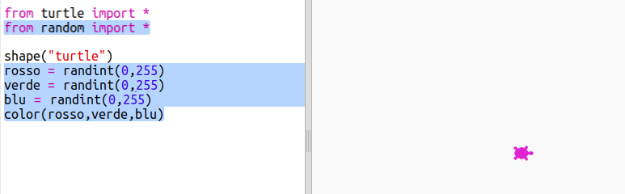
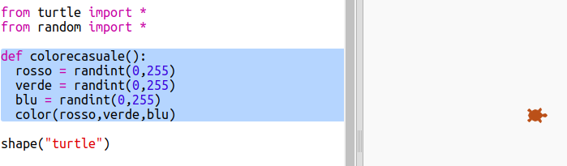
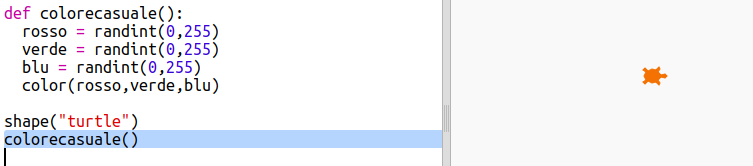

## Colori casuali

+ Apri questo trinket: <a href="http://jumpto.cc/modern-go" target="_blank">jumpto.cc/modern-go</a>.

+ Puoi impostare il colore di una tartaruga scegliendo la quantità di rosso, verde e blu che desideri da 0 a 255.
    
    Aggiungi il seguente codice per ottenere una tartaruga viola:
    
    
    
    Il viola è ottenuto mescolando insieme rosso e blu.

+ Prova valori diversi per ottenere colori diversi.
    
    Ricorda che ogni numero può essere compreso tra 0 e 255.

+ Che ne dici di scegliere un colore casuale?
    
    Aggiorna il codice per scegliere un numero casuale compreso tra 0 e 255 per i valori rosso, verde e blu:
    
    

+ Fai clic su "Esegui" un paio di volte per ottenere tartarughe di differenti colori.

+ È divertente, ma c'è molto da ricordare e digitare per far comparire ogni tartaruga con un colore casuale differente e non è molto facile da leggere.
    
    In Python possiamo scrivere `def` per definire una funzione che possiamo chiamare ogni volta che è necessario far comparire una tartaruga dal colore differente.
    
    Hai già chiamato funzioni, `color()` e `randint()` sono funzioni che sono state definite per te.
    
    Mettiamo il codice del colore casuale in una funzione usando def:
    
    
    
    Assicurati di far rientrare (indentare) il codice all'interno della funzione. Le funzioni vengono generalmente posizionate nella parte superiore dello script dopo le istruzioni di import.

+ Se "esegui" il tuo codice ora non ottieni una tartaruga colorata casualmente. Questo perché hai definito la tua funzione, ma non l'hai ancora chiamata.

+ Aggiungi una linea per chiamare la tua nuova funzione:
    
    
    
    Nota che il tuo nuovo codice è molto più facile da capire perché la parte complessa è nella funzione. È facile capire cosa `colorecasuale()` faccia.