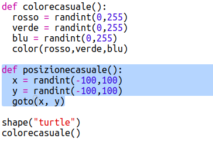

## Posizione casuale

Creiamo un'altra funzione per spostare la tartaruga in un punto casuale dello schermo. Il centro dello schermo è (0,0), quindi posizioneremo le tartarughe in un'area quadrata attorno al centro.

+ Aggiungi una funzione `posizionecasuale()`:
    
    

+ Prova la tua nuova funzione. Chiamandola e poi chiamando `stamp()` puoi eseguirla più di una volta:
    
    

+ Ooops, la tartaruga disegna quando si muove. Solleviamo la penna all'inizio e riappoggiamola solo alla fine, in modo che la tartaruga non disegni mentre si muove:
    
    
    
    Hai notato che hai dovuto "sistemare" il codice in un solo punto? Questa è un'altra buona proprietà delle funzioni.

+ Ora prova il tuo codice qualche volta.