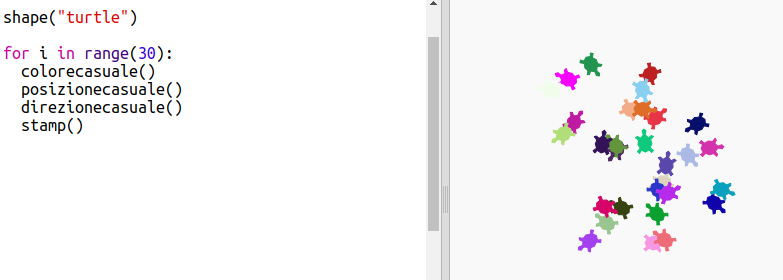

\--- challenge \---

## Sfida: Arte a tartaruga

Riesci a scrivere una funzione `direzionecasuale()` che faccia puntare la tartaruga in una direzione casuale e faccia funzionare il seguente codice?

Suggerimenti:

- `setheading(<number>)` cambierà la direzione verso cui la tartaruga punta.

- `<number>` deve essere compreso tra 1 e 360 ​​(il numero di gradi in un cerchio)

- Puoi usare `randint(1, 360)` per scegliere un numero compreso tra 1 e 360.

\--- /challenge \---