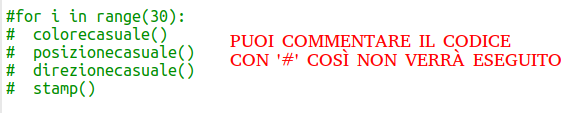
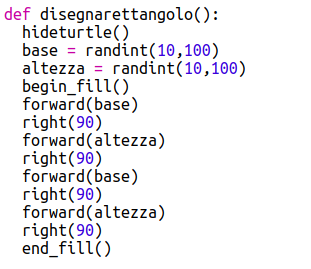
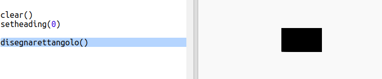
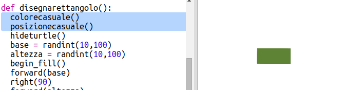
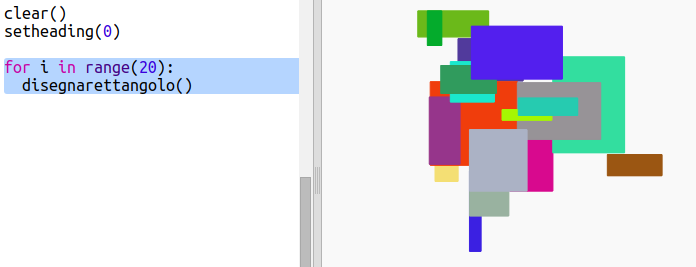

## Crea arte moderna rettangolare

Ora creiamo un po' di arte moderna disegnando tanti di rettangoli di diverse dimensioni e colori.

+ Prima aggiungi il seguente codice alla fine del tuo script, dopo il codice dell'ultima sfida, per cancellare lo schermo dopo l'ultima opera artistica con la tartaruga e fai puntare la tartaruga nella sua direzione abituale:
    
    

+ Puoi commentare parte del tuo codice posizionando un `#` all'inizio di ogni riga in modo che non funzioni mentre si realizziamo il codice sull'arte del rettangolo. (In seguito potrai rimuoverli per mostrare tutto il tuo lavoro.)
    
    

+ Ora aggiungiamo una funzione per disegnare un rettangolo di dimensioni, colore e posizione casuali!
    
    Aggiungi una funzione `disegnarettangolo()` dopo le altre funzioni:
    
    
    
    Cerca in `snippets.py` per qualche codice d'aiuto se vuoi risparmiare un po' di tempo.

+ Aggiungi il seguente codice nella parte inferiore di `main.py` per chiamare la tua nuova funzione:
    
    
    
    Esegui il tuo script alcune volte per vedere come cambiano altezza e larghezza.

+ Il rettangolo è sempre dello stesso colore e inizia nella stessa posizione.
    
    Ora dovrai impostare la tartaruga su un colore casuale e poi spostarla in una posizione casuale. Ehi, ma non hai già creato delle funzioni per farlo? Meraviglioso. Puoi chiamarli semplicemente all'inizio della funzione disegnarettangolo:
    
    
    
    Wow è bastato veramente poco ed il codice ed è molto più facile da leggere.

+ Ora chiamiamo `drawrectangle()` in un ciclo per creare una bella arte moderna:
    
    

+ Accidenti era un po' lento o no! Fortunatamente puoi accelerare la tartaruga.
    
    Trova la linea in cui imposti la forma a "tartaruga" e aggiungi il codice evidenziato:
    
    
    
    `speed(0)` è il più veloce ma puoi usare numeri compresi tra 1 (lento) e 10 (veloce). Prova fino a trovare la velocità che ti preferisci.