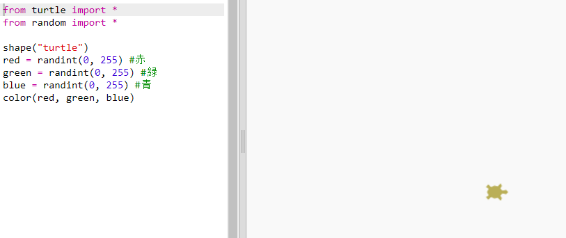
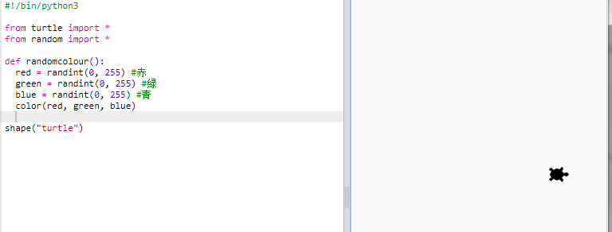
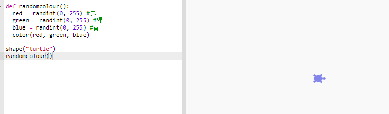

## ランダムな色

+ このトリンケットを開いて下さい: <a href="http://jumpto.cc/modern-go" target="_blank">jumpto.cc/modern-go</a>。

+ あなたは赤、緑、青が0から255まで、それぞれどれくらいの量かを言って、カメ(turtle)の色を設定することができます。
    
    紫色のカメを手に入れる為には、次のコードを追加します。
    
    
    
    紫は、赤と青を混ぜ合わせることで作られます。

+ ちがう色のカメを手に入れる為には、ちがう数字を試してみて下さい。
    
    それぞれの数字は、0から255の間であることを覚えておいてください。

+ どの様にランダムな色を選ぶのですか？
    
    赤、緑、青の値に0から255の間のランダムな数字を選ぶように、あなたのコードを更新してみましょう。
    
    

+ 違う色のカメを手に入れるには、‘Run’を何回かクリックして下さい。

+ これは楽しいですね。しかし、カメをランダムな色に設定するたびに覚えて入力する必要があるし、読みにくいです。
    
    Pythonでは、カメをランダムな色にする必要があるときにいつでも呼び出すことができる新しい関数を定義する`def`を書くことができます。
    
    あなたはすでに関数を呼び出しています。`Color()`と`randint()`はあなたのために定義された関数です。
    
    Defを使ってランダムなカラーコードを関数に入れてみましょう。
    
    
    
    関数の中ではコードがインデントされているか確認して下さいね。 関数は、通常、インポート後にスクリプトの先頭に配置されます。

+ もしあなたが今、自分のコードを実行しているなら、あなたはランダムな色のカメを手に入れられません。 これは、自分の関数を定義しましたが、まだ呼び出していないからです。

+ 新しい関数を呼び出すためには、行を追加して下さい。
    
    
    
    複雑な部分は関数の中にあるため、あなたの新しいコードは、ずっとわかりやすくなったことに注目して下さい。 `randomcolor()`が何をするのかは、簡単に分かります。