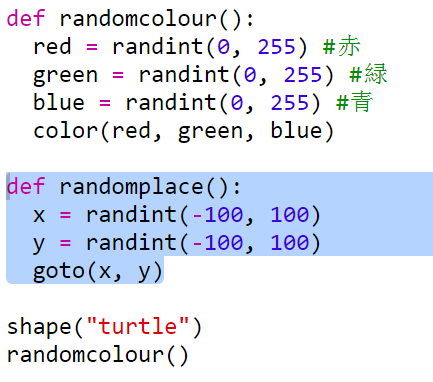

## ランダムに配置する

カメを画面上のランダムな場所に移動する、別の関数を作成しましょう。 画面の中心は(0, 0) なので、中心付近の四角いエリアにカメを配置します。

+ `randomplace()` 関数を追加します。
    
    

+ あなたの作った新しい関数を呼び出してみてから、`stamp()`を呼び出すと、それを複数回呼び出すことができます：
    
    

+ おっと！カメは動くと線を描きますね。 カメが動いている時に線を描かない様に、動き始めにはペンを持ち上げ、動き終わりにペンを下ろしてみましょう。
    
    
    
    コードを1カ所修正するだけで済むことに、気付きましたか？ それは関数についての、もう一つの良いことです。

+ 今度はコードを数回テストしてみてください。