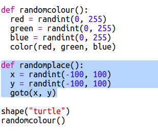

## ランダムに配置する

カメを画面上のランダムな場所に移動する、別の関数を作成しましょう。 画面の中心は(0, 0) なので、中心付近の四角いエリアにカメを配置します。

+ `randomplace()` 関数を追加します。
    
    

+ 新しい関数を呼び出してから、`stamp()`を呼び出してみてください、複数回呼び出すことができます:
    
    

+ おっと！カメは動くと線を描きますね。 動き始めにペンを持ち上げ、動き終わりにペンを下ろしてみましょう、するとカメは動く時に描きません:
    
    
    
    コードを1カ所修正するだけで済むことに、気付きましたか？ それは関数についての、もう一つの良いことです。

+ 次にコードを数回テストしてみてください。