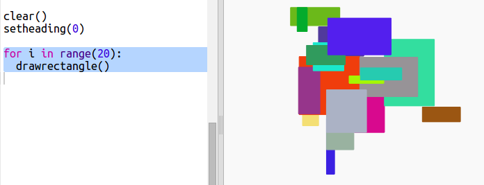

## 長方形のモダンアートを作る

さあ、いろんなサイズと色の長方形をたくさん描いてモダンアートを作ってみましょう。

+ 最初に、次のコードをあなたのスクリプトの下、チャレンジコードの後に追加し、あなたのカメのアートの後画面をクリアし、カメを通常の方向にします。
    
    

+ カメのアートのコードのそれぞれの行の先頭に`#`を置いてコメントアウトすると、長方形アートの作業をしている間、実行しないようになります。 (その後、コメントを外してすべての作業を表示することができます。)
    
    

+ では、ランダムな大きさで、ランダムな色の長方形をランダムな場所に描く関数を追加しましょう！
    
    他の関数の後に、`drawrectangle()` 関数を追加して下さい:
    
    
    
    入力する時間を節約したい場合は、`snippets.py`のヘルパーコードを調べてください。

+ `main.py`の最後に次のコードを追加して、あなたの新しい関数を呼び出します。
    
    
    
    スクリプトを何回か実行して、高さと幅を変えて見てみましょう。

+ 長方形はいつも同じ色で、同じ場所から始まります。
    
    次に、カメをランダムな色に設定して、ランダムな場所に移動する必要があります。 ねえ、あなたはすでにそれを行うための関数を作りませんでしたか？ すばらしい！ drawrectangle関数の最初から、それを呼び出すだけです:
    
    
    
    うわー、それははるかに少ない作業で、読むのがずっと簡単ですね。

+ 次に、ループの中で`drawrectangle()`を呼び出して、いくつかのクールなモダンアートを作ってみましょう:
    
    

+ おやまあ、これはちょっと遅くなかったですか！ ラッキーなことに、あなたはカメのスピードを上げることができます。
    
    形状を'turtle'に設定した行を見つけ、ハイライトされたコードを追加します:
    
    
    
    `speed(0)`が最も速く、または1(遅い) から10(速い) までの数字を使用できます。あなたが好きなスピードを見つけるまで試してみてください。