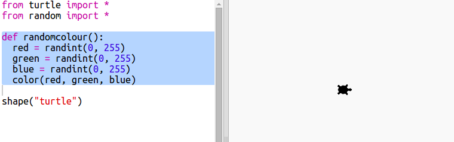

## ವಿಭಿನ್ನ ಬಣ್ಣಗಳು

+ ಈ trinket ತೆರೆಯಿರಿ:<a href="http://jumpto.cc/modern-go" target="_blank">jumpto.cc/modern-go</a> .

+ 0 ರಿಂದ 255 ರವರೆಗೆ ನೀವು ಎಷ್ಟು Red, green ಮತ್ತು blue ಬಣ್ಣವನ್ನು ಬಯಸುತ್ತೀರಿ ಎಂದು ಹೇಳುವ ಮೂಲಕ ನೀವು ಆಮೆಯ ಬಣ್ಣವನ್ನು ಹೊಂದಿಸಬಹುದು.
    
    Purple ಆಮೆ ಪಡೆಯಲು ಈ ಕೆಳಗಿನ ಕೋಡ್ ಸೇರಿಸಿ:
    
    
    
    Red ಮತ್ತುblue ಬಣ್ಣಗಳನ್ನು ಬೆರೆಸಿ purple ಬಣ್ಣವನ್ನು ತಯಾರಿಸಲಾಗುತ್ತದೆ.

--- collapse ---
---
title: "ದೋಷ - ಕೆಟ್ಟ ಬಣ್ಣ ಅನುಕ್ರಮ: (150, 0, 150)"
---

ನೀವು ದೋಷವನ್ನು ಪಡೆಯುತ್ತೀರಾ `bad color sequence: (150, 0, 150)` ನಿಮ್ಮ ಕೋಡ್ ಅನ್ನು ಚಲಾಯಿಸುವಾಗ.

ಏಕೆಂದರೆ trinket ಇತರ ಪೈಥಾನ್ ಸಂಪಾದಕರಿಗೆ ವಿಭಿನ್ನ ಬಣ್ಣ ಮೋಡ್ ಅನ್ನು ಬಳಸುತ್ತದೆ. `colormode` ವನ್ನು `255` ಗೆ ಬದಲಾಯಿಸುವ ಮೂಲಕ ಅದನ್ನು ಸರಿಪಡಿಸಬಹುದು.

```python
from turtle import *

colormode(255)

shape("turtle")
color(150,0,150)
```

--- /collapse ---

+ ವಿಭಿನ್ನ ಬಣ್ಣಗಳನ್ನು ಪಡೆಯಲು ಕೆಲವು ವಿಭಿನ್ನ ಸಂಖ್ಯೆಗಳನ್ನು ಪ್ರಯತ್ನಿಸಿ.
    
    ಪ್ರತಿ ಸಂಖ್ಯೆ 0 ರಿಂದ 255 ರವರೆಗೆ ಇರಬಹುದು ಎಂಬುದನ್ನು ನೆನಪಿಡಿ.

+ ಯಾದೃಚ್ color ಿಕ ಬಣ್ಣವನ್ನು ಆರಿಸುವ ಬಗ್ಗೆ ಹೇಗೆ?
    
    Red, green ಮತ್ತು blue ಮೌಲ್ಯಗಳಿಗಾಗಿ 0 ಮತ್ತು 255 ರ ನಡುವೆ ಯಾದೃಚ್ ಿಕ ಸಂಖ್ಯೆಯನ್ನು ಆಯ್ಕೆ ಮಾಡಲು ನಿಮ್ಮ ಕೋಡ್ ಅನ್ನು ನವೀಕರಿಸಿ:
    
    

+ ವಿಭಿನ್ನ ಬಣ್ಣದ ಆಮೆಗಳನ್ನು ಪಡೆಯಲು ಕೆಲವು ಬಾರಿ 'Run' ಕ್ಲಿಕ್ ಮಾಡಿ.

+ ಇದು ತಮಾಷೆಯಾಗಿದೆ, ಆದರೆ ಇದನ್ನು ನೆನಪಿಟ್ಟುಕೊಳ್ಳಲು ಬಹಳಷ್ಟು ಇದೆ ಮತ್ತು ಆಮೆಯನ್ನು ಯಾದೃಚ್ ಿಕ ಬಣ್ಣಕ್ಕೆ ಹೊಂದಿಸಲು ಪ್ರತಿ ಬಾರಿಯೂ ನೀವು ಟೈಪ್ ಮಾಡಬೇಕು ಮತ್ತು ಅದನ್ನು ಓದುವುದು ತುಂಬಾ ಸುಲಭವಲ್ಲ.
    
    ಪೈಥಾನ್‌ನಲ್ಲಿ ನಾವು `def` ಬರೆದ ಮೂಲಕ ಆಮೆಯನ್ನು ಯಾದೃಚ್ ಿಕ ಬಣ್ಣಕ್ಕೆ ಹೊಂದಿಸಬೇಕಾದಾಗ ನಾವು ಕರೆಯಬಹುದಾದ ಫುನ್ಕ್ಷನ್ವನ್ನು ವ್ಯಾಖ್ಯಾನಿಸಬಹುದು.
    
    ನೀವು ಈಗಾಗಲೇ ಫಂಕ್ಷನ್ ಗಳನ್ನು ಕರೆಯುತ್ತಿದ್ದೀರಿ, `color()` ಮತ್ತು `randint()` ನಿಮಗಾಗಿ ವ್ಯಾಖ್ಯಾನಿಸಲಾದ ಫಂಕ್ಷನ್ ಗಳು.
    
    ಡೆಫ್ ಅನ್ನು ಬಳಸಿಕೊಂಡು ಯಾದೃಚ್ ಿಕ ಬಣ್ಣ ಕೋಡ್ ಅನ್ನು ಒಂದು ಫಂಕ್ಷನ್ ನಲ್ಲಿ ಇಡೋಣ:
    
    
    
    ಪಂಕ್ಷನ್ ಒಳಗೆ ನೀವು ಕೋಡ್ ಅನ್ನು ಇಂಡೆಂಟ್ ಮಾಡಿದ್ದೀರಿ ಎಂದು ಖಚಿತಪಡಿಸಿಕೊಳ್ಳಿ. ಫಂಕ್ಷನ್ಸ್ಗಳನ್ನು ಸಾಮಾನ್ಯವಾಗಿ ಆಮದು ಮಾಡಿದ ನಂತರ ಸ್ಕ್ರಿಪ್ಟ್‌ನ ಮೇಲ್ಭಾಗದಲ್ಲಿ ಇರಿಸಲಾಗುತ್ತದೆ.

+ ನಿಮ್ಮ ಕೋಡ್ ಅನ್ನು ನೀವು ಈಗ 'Run' ಮಾಡಿದರೆ ನಿಮಗೆ ಯಾದೃಚ್ ಿಕ ಬಣ್ಣದ ಆಮೆ ಸಿಗುವುದಿಲ್ಲ. ನಿಮ್ಮ ಫಂಕ್ಷನ್ವನ್ನು ನೀವು ವ್ಯಾಖ್ಯಾನಿಸಿದ್ದೀರಿ, ಆದರೆ ಅದನ್ನು ಇನ್ನೂ ಕರೆಯಲಿಲ್ಲ.

+ ನಿಮ್ಮ ಹೊಸ ಫಂಕ್ಷನ್ವನ್ನು ಕರೆಯಲು ಒಂದು ಸಾಲನ್ನು ಸೇರಿಸಿ:
    
    
    
    ನಿಮ್ಮ ಹೊಸ ಕೋಡ್ ಅರ್ಥಮಾಡಿಕೊಳ್ಳುವುದು ತುಂಬಾ ಸುಲಭ ಎಂಬುದನ್ನು ಗಮನಿಸಿ ಏಕೆಂದರೆ ಸಂಕೀರ್ಣ ಭಾಗವು ಫಂಕ್ಷನ್ನಲ್ಲಿಲ್ದೆ. `randomcolor()` ಮಾಡುವುದು ಸುಲಭ.