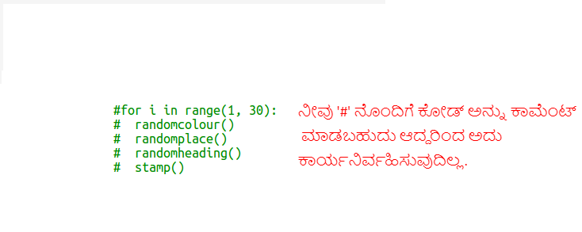

## ಆಯತ ನವ್ಯಕಲೆಗಳನ್ನು ರಚಿಸಿ

ಈಗ ವಿಭಿನ್ನ ಗಾತ್ರಗಳು ಮತ್ತು ಬಣ್ಣಗಳ ಸಾಕಷ್ಟು ಆಯತಗಳನ್ನು ಚಿತ್ರಿಸುವ ಮೂಲಕ ಕೆಲವು ನವ್ಯಕಲೆಗಳನ್ನು ರಚಿಸೋಣ.

+ ನಿಮ್ಮ ಆಮೆ ಕಲೆಯ ನಂತರ ಪರದೆಯನ್ನು ತೆರವುಗೊಳಿಸಲು ಮತ್ತು ಆಮೆಗಳನ್ನು ಅದರ ಸಾಮಾನ್ಯ ದಿಕ್ಕಿನಲ್ಲಿ ತೋರಿಸಲು ಮೊದಲು ಈ ಕೆಳಗಿನ ಕೋಡ್ ಅನ್ನು ನಿಮ್ಮ ಸವಾಲಿನ ಕೋಡ್ ನಂತರ ನಿಮ್ಮ ಸ್ಕ್ರಿಪ್ಟ್‌ನ ಕೆಳಭಾಗಕ್ಕೆ ಸೇರಿಸಿ:
    
    

+ ನೀವು `#` ಅನ್ನು ಪ್ರತಿ ಸಾಲಿನ ಆರಂಭದಲ್ಲಿ ಇರಿಸುವ ಮೂಲಕ ನಿಮ್ಮ ಆಮೆ ಕಲಾ ಸಂಕೇತವನ್ನು ನೀವು ಕಾಮೆಂಟ್ ಮಾಡಬಹುದು ಆದ್ದರಿಂದ ಆಯತ ಕಲೆಯಲ್ಲಿ ಕೆಲಸ ಮಾಡುವಾಗ ಅದು ಕಾರ್ಯನಿರ್ವಹಿಸುವುದಿಲ್ಲ. (ನಂತರ ನಿಮ್ಮ ಎಲ್ಲಾ ಕೆಲಸಗಳನ್ನು ಪ್ರದರ್ಶಿಸಲು ನೀವು ಅದನ್ನು ಅನಾವರಣಗೊಳಿಸಬಹುದು.)
    
    

+ ಈಗ ಯಾದೃಚ್ಕ ಗಾತ್ರದ, ಯಾದೃಚ್ಕ-ಬಣ್ಣದ ಆಯತವನ್ನು ಯಾದೃಚ್ಕ ಸ್ಥಳದಲ್ಲಿ ಸೆಳೆಯಲು ಒಂದು ಫುನ್ಕ್ಷನ್ವನ್ನು ಸೇರಿಸೋಣ!
    
    `drawrectangle()` ಫುನ್ಕ್ಷನ್ ವನು ನಿಮ್ಮ ಇತರ ಫುನ್ಕ್ಷನ್ಸ್ ಗಳ ನಂತರ ಸೇರಿಸಿ:
    
    
    
    ನೀವು ಕೆಲವು ಟೈಪಿಂಗ್ ಸಮಯವನ್ನು ಉಳಿಸಲು ಬಯಸಿದರೆ `snippets.py` ನಲ್ಲಿ ಕೆಲವು ಸಹಾಯಕ ಕೋಡ್‌ಗಾಗಿ ನೋಡಿ.

+ ನಿಮ್ಮ ಹೊಸ ಫುನ್ಕ್ಷನ್ವನ್ನು ಕರೆಯಲು `main.py` ನ ಕೆಳಭಾಗದಲ್ಲಿ ಈ ಕೆಳಗಿನ ಕೋಡ್ ಸೇರಿಸಿ:
    
    
    
    ಎತ್ತರ ಮತ್ತು ಅಗಲ ಬದಲಾವಣೆಯನ್ನು ನೋಡಲು ನಿಮ್ಮ ಸ್ಕ್ರಿಪ್ಟ್ ಅನ್ನು ಕೆಲವು ಬಾರಿ ಚಲಾಯಿಸಿ.

+ ಆಯತವು ಯಾವಾಗಲೂ ಒಂದೇ ಬಣ್ಣದ್ದಾಗಿರುತ್ತದೆ ಮತ್ತು ಅದೇ ಸ್ಥಳದಲ್ಲಿ ಪ್ರಾರಂಭವಾಗುತ್ತದೆ.
    
    ಈಗ ನೀವು ಆಮೆಯನ್ನು ಯಾದೃಚ್ಕ ಬಣ್ಣಕ್ಕೆ ಹೊಂದಿಸಿ ನಂತರ ಅದನ್ನು ಯಾದೃಚ್ಕ ಸ್ಥಳಕ್ಕೆ ಸರಿಸಬೇಕಾಗುತ್ತದೆ. ಹೇ, ಅದನ್ನು ಮಾಡಲು ನೀವು ಈಗಾಗಲೇ ಫುನ್ಕ್ಷನ್ಸ್ಗಳನ್ನು ರಚಿಸಲಿಲ್ಲವೇ? ಅದ್ಭುತ. ಡ್ರಾಕ್ಟಾಂಗಲ್ ಫುನ್ಕ್ಷನ್ ಪ್ರಾರಂಭದಿಂದ ನೀವು ಅವರನ್ನು ಕರೆಯಬಹುದು:
    
    
    
    ವಾಹ್ ಅದು ತುಂಬಾ ಕಡಿಮೆ ಕೆಲಸವಾಗಿತ್ತು, ಮತ್ತು ಅದನ್ನು ಓದುವುದು ತುಂಬಾ ಸುಲಭ.

+ ಈಗ `drawrectangle()` ಲೂಪ್‌ನಲ್ಲಿ ಕೆಲವು ತಂಪಾದ ನವ್ಯಕಲೆಗಳನ್ನು ರಚಿಸಲು ಎಂದು ಕರೆಯೋಣ:
    
    

+ ಗೋಶ್ ಸ್ವಲ್ಪ ನಿಧಾನವಾಗಿದ್ದ ಅಲ್ಲವೇ! ಅದೃಷ್ಟವಶಾತ್ ನೀವು ಆಮೆ ವೇಗಗೊಳಿಸಬಹುದು.
    
    ನೀವು ಆಕಾರವನ್ನು 'turtle' ಗೆ ಹೊಂದಿಸಿದ ರೇಖೆಯನ್ನು ಹುಡುಕಿ ಮತ್ತು ಹೈಲೈಟ್ ಮಾಡಿದ ಕೋಡ್ ಅನ್ನು ಸೇರಿಸಿ:
    
    
    
    `speed(0)` ಇದು ವೇಗವಾದದ್ದು ಅಥವಾ ನೀವು 1 (ನಿಧಾನ) ದಿಂದ 10 (ವೇಗದ) ಸಂಖ್ಯೆಗಳನ್ನು ಬಳಸಬಹುದು. ನೀವು ಇಷ್ಟಪಡುವ ವೇಗವನ್ನು ಕಂಡುಕೊಳ್ಳುವವರೆಗೆ ಪ್ರಯೋಗ ಮಾಡಿ.