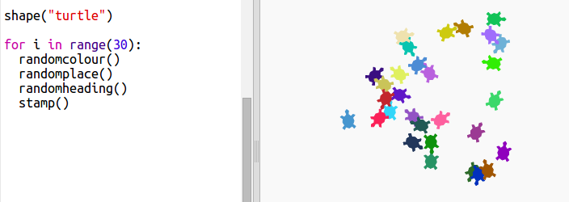

\--- challenge \---

## 도전 과제: 거북이 미술

거북이가 무작위 방향을 바라보게 만드는 `randomheading()` 함수를 정의해보세요. 다음의 코드가 정상적으로 작동해야 합니다.

힌트:

- `setheading(<number>)` 함수는 거북이가 바라보는 방향을 바꿉니다.

- `<number>` 는 1부터 360까지 가능합니다. (원에서의 각도를 의미합니다.)

- `randint(1, 360)`를 사용해서 1 이상 360 이하의 무작위 정수를 만들 수 있습니다.

\--- /challenge \---