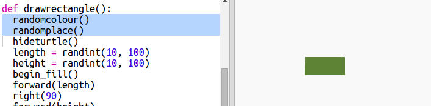

## 사각형 현대 미술 작품 만들기

이제, 다양한 크기와 색상의 직사각형을 많이 그려서 현대 미술 작품을 만들어 보겠습니다.

+ 먼저 다음 코드를 스크립트 파일 아래쪽에, 이전의 도전 과제 코드 다음에 추가하세요. 다음 코드는 거북이 미술 작품이 만들어진 후 화면을 지우고 거북이가 원래 방향을 바라보게 만듭니다:
    
    

+ 우리가 사각형 미술을 만드는 동안 거북이 미술 코드는 실행되지 않게 하기 위해서, 거북이 미술 코드에서 각 줄의 맨 앞에 `#`을 추가해서 주석 처리를 할 수 있습니다. (그리고 나중에 주석을 해제하면 우리가 만든 것을 모두 실행시켜서 확인할 수 있습니다.)
    
    

+ 이제 무작위 크기의 무작위 색상의 사각형을 무작위 위치에 생성하는 함수를 추가해봅시다!
    
    `drawrectangle()` 함수를 우리가 만든 다른 함수들 뒤에 추가하세요:
    
    
    
    만약 타이핑하는데 드는 시간을 아끼고 싶다면, `snippets.py`에 있는 도우미 코드를 확인해보세요.

+ 다음의 코드를 `main.py` 끝 부분에 추가해서 우리가 만든 새로운 함수를 호출해봅시다.
    
    
    
    지금까지 만든 스크립트 파일을 여러 번 실행해보고 사각형의 너비 및 높이의 변화를 관찰해보세요.

+ 사각형이 언제나 똑같은 색상에 똑같은 위치에 생성되네요.
    
    이제 우리는 거북이를 무작위 색상으로 설정하고 무작위 위치로 이동시킬 필요가 있습니다. 저기, 그런 일을 하는 함수를 이미 만들지 않았나요? 좋아요. 우리는 drawrectangle 함수의 시작 부분에서 이전에 만들었던 함수들을 그저 호출하기만 하면 됩니다.
    
    
    
    놀랍지 않나요? 이번에는 거의 쓴 것도 없고, 이해하기도 훨씬 쉽네요.

+ 이제 반복문 안에서 `drawrectangle()` 함수를 호출해서 멋진 현대 미술 작품을 만들어봅시다:
    
    

+ 이거, 좀 느리지 않나요? 다행히도 우리는 거북이의 속도를 높여서 빠르게 그릴 수 있답니다.
    
    `shape("turtle")`을 찾아서 그 밑에다 다음의 강조 표시된 코드를 넣어봅시다.
    
    
    
    `speed(0)`은 속도를 가장 빠르게 설정합니다. 또한 우리는 수를 1(느림)부터 10(빠름)까지 설정할 수도 있습니다. 원하는 속도를 찾을 때까지 실험해보세요.